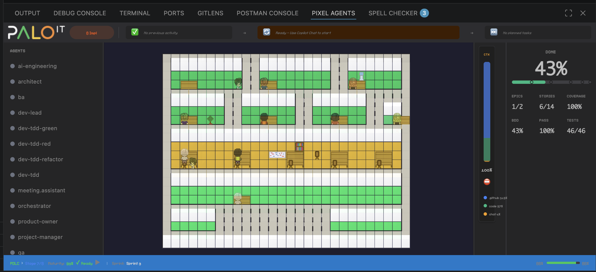

# Pixel Agents

A VS Code extension that turns your AI coding agents into animated pixel art characters in a virtual office.

Each GitHub Copilot agent you launch spawns a character that walks around, sits at desks, and visually reflects what the agent is doing — typing when writing code, reading when searching files, waiting when it needs your attention.

## Screenshot



**Live Dashboard Features:**
- **Left Panel**: Agent Registry showing 12+ AI agents with real-time status (green = active, gray = idle)
- **Center Canvas**: 2D office layout with animated character sprites working at desks
- **Right Panel**: Completeness meter showing project progress (43% in screenshot), epics/stories/coverage breakdown
- **Top Bar**: Task progression showing previous → current → next workflow context with TDD phase
- **Status Bar**: PDLC stage detection (Stage 2/8), current sprint, active user story, and document completion checklist
- **Context Window**: Token usage visualization with warnings at 71%+ (yellow) and 90%+ (red)

## Features

- **One agent, one character** — every GitHub Copilot agent gets its own animated character
- **Live activity tracking** — characters animate based on what the agent is actually doing (writing, reading, running commands)
- **Workflow detection** — automatically detects PDLC stages, implementation phases, and TDD cycles from structured documents in `/docs/`, displaying real-time progress in the status bar
- **Milestone celebrations** — particle effects (confetti, star bursts, fireworks) trigger automatically at 25%, 50%, 75%, and 100% project completion with visual feedback and sound cues
- **Agent Registry** — collapsible panel showing all available agents from `.github/agents/` with real-time status, descriptions, and capabilities
- **GitHub directory highlighting** — automatically highlights when agents access `.github/` configuration files
- **Agent roles and metadata** — displays agent names, descriptions, and capabilities from `.agent.md` definitions
- **Multi-agent handoff animation** — when one agent completes a task and hands off to another, watch directional arrows, animated path lines, and hear a notification chime
- **Office layout editor** — design your office with floors, walls, and furniture using a built-in editor
- **Action bubbles with captions** — click any agent to see speech bubbles with real-time activity text ("Idle", "Working...", etc.)
- **Agent selection sync** — clicking an agent in the sidebar highlights the character in the office, and vice versa
- **Workflow footer bar** — displays PDLC stage, current sprint, active story, and progress with Palo IT brand colors
- **Sound notifications** — VS Code notification API integration with milestone-specific sounds (info, warning, celebration), error/success/warning audio cues, and optional chimes for agent handoff transitions
- **Performance monitoring** — real-time FPS tracking, render time monitoring, and memory usage tracking with frame throttling (12 FPS) to prevent IDE crashes
- **Accessibility compliance** — WCAG 2.1 AA compliant with full keyboard navigation, screen reader support, and high-contrast design token system
- **Persistent layouts** — your office design is saved and shared across VS Code windows (~/.pixel-agents/layout.json)
- **Diverse characters** — 6 built-in character sprites supporting 11+ agents (orchestrator, ai-eng, architect, ba, ux, qa, pm, po, dev-lead, tdd-orchestrator, meeting-assistant)

## Requirements

- VS Code 1.109.0 or later
- GitHub Copilot (included in VS Code — no additional installation required)

## Getting Started

### Install from source (for development)

For active development and testing:

```bash
git clone <repository-url>
cd pixel-agents
npm install
cd webview-ui && npm install && cd ..
```

Then open the project in VS Code and press **F5** to launch the Extension Development Host (a separate VS Code window for testing).

### Install from Pre-built VSIX (Easiest for Newbies)

The quickest way to try Pixel Agents without building from source:

1. **Download** `pixel-agents-1.0.5.vsix` from the project releases (or from the file you just packaged)
2. **Open VS Code**
3. **Install via Command Palette**:
   - Press `Cmd+Shift+P` (Mac) or `Ctrl+Shift+P` (Windows/Linux)
   - Type: `Extensions: Install from VSIX`
   - Select the `pixel-agents-1.0.5.vsix` file
4. **Or install via drag-and-drop**:
   - Open Extensions view (`Cmd+Shift+X` / `Ctrl+Shift+X`)
   - Click the `...` menu at the top
   - Select "Install from VSIX..."
   - Choose the `.vsix` file
5. **Reload VS Code** when prompted
6. Look for the **PIXEL AGENTS** tab in your VS Code bottom panel — it's now active!

### Build and Package from Source

To create a custom build:

```bash
cd pixel-agents
npm install
cd webview-ui && npm install && cd ..
npm run package
```

This creates `pixel-agents-1.0.5.vsix` in the project root. Install using the steps above.

### First-Time Setup (Newbie Guide)

**Step 1: Open the Dashboard**
1. After installing and reloading VS Code, look for the **PIXEL AGENTS** tab at the bottom of the editor
2. Click it to open the dashboard
3. You should see the office canvas with furniture and empty desks

**Step 2: Launch Your First Agent**
1. Open **Copilot Chat** (`Cmd+I` / `Ctrl+I`)
2. Type a coding question or task (e.g., "@workspace help me understand this function")
3. Watch the agent sidebar on the left — one of the agents will become **active** (green dot)
4. A **character sprite appears on the office canvas** and starts animating
5. The **action bubble** shows what the agent is doing ("Reading...", "Writing...", "Idle")

**Step 3: Monitor Workflow Progress**
1. Open or create a `/docs/` folder in your project with the following structure:
   ```
   docs/
   ├── 01-requirements/
   │   └── user-stories.md
   ├── 02-architecture/
   │   └── tech-spec.md
   ├── 03-testing/
   │   └── test-strategies.md
   ├── 04-planning/
   ├── 05-implementation/
   │   └── user-stories.md
   ```
2. As you work, the dashboard **automatically detects your workflow stage**
3. The **status bar at the bottom** shows: "PDLC > Stage X/8" with progress tracking
4. The **completeness meter on the right** updates in real-time (25%, 50%, 75%, 100% milestones trigger celebrations)

**Step 4: Customize Your Office**
1. Click **Layout** button to open the office editor
2. Use tools to:
   - **Paint** floor colors
   - **Place** furniture and desks
   - **Build** walls
3. Click **Save** to persist your design
4. Your layout is automatically shared across VS Code windows

**Step 5: Check Agent Registry**
1. Look at the **left sidebar** showing all available agents:
   - 🤖 orchestrator — coordinates workflows
   - 💡 ai-engineering — optimizes prompts and models
   - 🏗️ architect — designs system architecture
   - 📊 ba — creates functional specs
   - 🎨 ux — designs user experiences
   - ✅ qa — validates quality
   - 📋 dev-lead — pre-plans implementation
   - 💻 dev-tdd-* — executes RED/GREEN/REFACTOR cycles
   - 🤝 meeting-assistant — transforms transcripts to meeting minutes
2. Click an agent in the sidebar to **focus on that character** in the office

## Agent Registry

A collapsible panel in the top-right corner displays:

- **Active Agents** — currently running agents with real-time status (Idle, Reading, Writing, etc.)
- **Available Agents** — all agent definitions from `.github/agents/` directory with descriptions and capabilities
- **GitHub File Highlighting** — agents accessing `.github/` configuration files are highlighted with a red border and glow effect
- **Agent Metadata** — shows agent roles, descriptions, and argument hints from `.agent.md` YAML frontmatter
- **Click to Focus** — click any agent to focus its terminal in VS Code

### Agent Definitions

Agents are defined in `.github/agents/` as `.agent.md` files with YAML frontmatter:

```yaml
---
name: "AI Engineering Agent"
description: "Expert-level AI systems optimization"
argumentHint: "Optimize prompts, select models, or evaluate AI systems"
---

# Agent behavior and instructions...
```

The Agent Registry automatically discovers all agent definitions and displays them, making it easy to see what agents are available in your project.

### GitHub File Access Tracking

When an agent reads, edits, or creates files in the `.github/` directory:
- The agent appears with a **red border** in the registry
- The **last accessed file** is shown in the activity status
- This helps visualize when agents are accessing configuration, workflows, or prompt definitions

## Workflow Footer Bar

A status bar at the bottom of the office displays the current development workflow with Palo IT brand colors:

- **Workflow Type** — Shows PDLC, Implementation, CI/CD, or None (green #00C853)
- **Stage/Phase** — Color-coded display ("Stage X/8" in blue #3B82F6, TDD phases in RED/GREEN/REFACTOR colors)
- **Active User Story** — Displays the current story being worked on (yellow #FFD600)
- **Current Sprint** — Shows active sprint number
- **Progress Tracking** — Visual progress bar with percentage completion
- **PRD Maturity** — Expandable checklist showing document completion status (PDLC workflow only)
- **Real-time Updates** — Automatically updates when documents in `/docs/` change

Workflow detection parses:
- `/docs/01-requirements/`, `/docs/02-architecture/`, `/docs/03-testing/`, `/docs/04-planning/` — PDLC stage completion
- `/docs/05-implementation/user-stories.md` — Implementation status and story progress
- `/docs/05-implementation/epics/<EPIC-REF>/user-stories/<US-REF>/implementation-plan.md` — TDD phase and active layer
- `/docs/05-implementation/current-sprint.md` — Current sprint info

The status bar hides gracefully if no docs folder is detected.

## Layout Editor

The built-in editor lets you design your office:

- **Floor** — Full HSB color control
- **Walls** — Auto-tiling walls with color customization
- **Tools** — Select, paint, erase, place, eyedropper, pick
- **Undo/Redo** — 50 levels with Ctrl+Z / Ctrl+Y
- **Export/Import** — Share layouts as JSON files via the Settings modal

The grid is expandable up to 64×64 tiles. Click the ghost border outside the current grid to grow it.

### Office Assets

The office tileset used in this project and available via the extension is **[Office Interior Tileset (16x16)](https://donarg.itch.io/officetileset)** by **Donarg**, available on itch.io for **$2 USD**.

This is the only part of the project that is not freely available. The tileset is not included in this repository due to its license. To use Pixel Agents locally with the full set of office furniture and decorations, purchase the tileset and run the asset import pipeline:

```bash
npm run import-tileset
```

Fair warning: the import pipeline is not exactly straightforward — the out-of-the-box tileset assets aren't the easiest to work with, and while I've done my best to make the process as smooth as possible, it may require some manual tweaking. If you have experience creating pixel art office assets and would like to contribute freely usable tilesets for the community, that would be hugely appreciated.

The extension will still work without the tileset — you'll get the default characters and basic layout, but the full furniture catalog requires the imported assets.

## How It Works

Pixel Agents uses VS Code's event APIs to track agent activity in real time. When an agent edits a file, runs a terminal command, or performs other development tasks, the extension detects these events and updates the character's animation accordingly. The integration is lightweight and non-intrusive — no external dependencies or configuration needed.

### Activity Detection

The extension monitors:
- **File edits** — detected via `onDidChangeTextDocument`
- **File creation/deletion** — detected via `onDidCreateFiles` / `onDidDeleteFiles`
- **Terminal execution** — detected via `onDidStartTerminalShellExecution`
- **GitHub file access** — flagged when any of the above occur in `.github/` directory

### Agent Metadata Loading

On extension activation:
1. The extension scans `.github/agents/` directory for all `.agent.md` files
2. Parses YAML frontmatter (name, description, argumentHint)
3. Sends agent definitions to the webview as `agentMetadataLoaded` message
4. Agent Registry displays all discovered agents with their metadata

### Workflow Detection

On webview ready:
1. The extension initializes WorkflowDetector with the workspace root
2. Scans `/docs/` directory for workflow state indicators
3. Detects current PDLC stage, implementation phase, user story progress
4. Sets up FileSystemWatcher to monitor `/docs/**/*.{md,yml,yaml}` files
5. Sends initial state and forwards updates to webview via `workflowUpdated` message
6. WorkflowStatusBar renders current state with real-time progress tracking

### Real-time Status Updates

Character animations are driven by activity events:
- **Idle** — no activity detected in last 8 seconds
- **Writing** (typing animation) — agent editing code files
- **Reading** (reading animation) — agent searching or fetching files
- **Waiting** (permission bubble) — agent blocked waiting for user input
- **GitHub access highlight** — red visual indicator when accessing `.github/` files

The webview runs a lightweight game loop with canvas rendering, BFS pathfinding, and a character state machine (idle → walk → type/read). Everything is pixel-perfect at integer zoom levels.

### Milestone Celebrations

The extension tracks project completion across multiple dimensions:
- **Stories completed** — tracks user story implementation progress from `/docs/05-implementation/user-stories.md`
- **Test coverage** — monitors test suite growth and coverage percentages
- **Code coverage** — tracks overall code coverage metrics
- **PRU efficiency** — measures prompt resource unit usage efficiency

When milestones are reached (25%, 50%, 75%, 100%), the extension triggers:
- **Particle effects** — physics-based confetti (25%, 50%), star bursts (75%), and fireworks (100%) using Palo IT brand colors
- **Sound notifications** — VS Code notification API plays milestone-specific sounds with different severity levels for audio variety
- **Visual feedback** — milestone markers on the completeness meter bounce with animations
- **Agent celebrations** — all agent characters perform celebration animations at 100% completion

### Performance Optimization

The extension includes comprehensive performance monitoring with intelligent frame throttling:
- **Frame throttling** — game loop runs at 12 FPS (FRAME_SKIP = 4) to prevent CPU burn and IDE crashes while maintaining smooth animations
- **FPS tracking** — real-time frames-per-second calculation with performance metrics logging
- **Render time monitoring** — tracks frame render time with threshold warnings
- **Memory usage tracking** — monitors memory consumption (threshold: <100MB)
- **Component render counting** — tracks React component re-render frequency
- **Threshold warnings** — logs performance warnings to VS Code OutputChannel when thresholds are exceeded
- **Viewport culling** — only renders objects within the visible canvas area (AABB collision detection)

## Tech Stack

- **Extension**: TypeScript, VS Code Webview API, esbuild
- **Webview**: React 19, TypeScript, Vite, Canvas 2D
- **Testing**: Jest, React Testing Library, jest-axe (accessibility), ts-jest (>80% coverage)
- **Design System**: CSS custom properties with 200+ design tokens (Palo IT branding v2.0.0, VS Code dark theme)
- **Performance**: 12 FPS game loop (throttled) with viewport culling, physics-based particle system
- **Build**: VSIX packaging via @vscode/vsce (~1.03 MB, 104 files)

## Troubleshooting

### Dashboard shows "Ready — Use Copilot Chat to start" but nothing happens
**Solution**: Open Copilot Chat (`Cmd+I` / `Ctrl+I`) and ask a coding question. Agents only appear when actively being used by Copilot.

### Agents appear but no workflow status shows
**Solution**: Create the `/docs/` directory structure. Pixel Agents automatically detects workflow documents and begins tracking progress.

### Context Window Bar shows 100% and I can't interact with Copilot
**Solution**: Start a new Copilot Chat conversation (`Cmd+L` / `Ctrl+L`) to reset the context window.

### Extensions says "No previous activity"
**Solution**: This is normal on first launch. Run some code edits or file operations, and the activity bubble will update.

### Office layout won't save
**Solution**: Check that VS Code has file system permissions to write to `~/.pixel-agents/layout.json`. Create the directory if it doesn't exist.

### Performance is slow or IDE feels sluggish
**Solution**: Pixel Agents is optimized with frame throttling (12 FPS), but if you experience issues:
1. Close other CPU-intensive tabs
2. Restart VS Code
3. Clear the VS Code cache: `rm -rf ~/.vscode-insiders`

### Extension won't load or shows errors
**Solution**:
1. Check the DEBUG CONSOLE for error messages
2. Try reloading the extension: Press `Cmd+Shift+P` / `Ctrl+Shift+P` and type "Developer: Reload Window"
3. If issues persist, reinstall the `.vsix` file

## Known Limitations

- **Multi-platform testing** — tested primarily on Windows 11 and macOS. Linux support available but less thoroughly tested.
- **Activity inference** — character animations inferred from VS Code events. Some agent activities may not trigger visible animations.
- **Agent metadata scoping** — agent definitions in `.github/agents/` loaded once on startup. New agents require extension reload.
- **Workflow document detection** — requires strict folder structure (`/docs/01-requirements/`, `/docs/05-implementation/user-stories.md`, etc.).
- **TDD checkpoint tracking** — requires `implementation-plan.md` checkbox format in each user story folder (`docs/05-implementation/epics/EPIC-X/user-stories/US-X/`).

## Quick Start: Testing All Features

### Test 1: Agent Registry (Immediate)
1. Install and launch the extension
2. Look at the **left sidebar** — shows all 12+ agents from `.github/agents/`
3. ✅ **Expected**: See agent names with status dots (gray = idle)

### Test 2: Live Agent Activity (5 minutes)
1. Open **Copilot Chat** (`Cmd+I`)
2. Ask: "@workspace what files are in the src/ directory?"
3. Watch the **office canvas** — a character appears and sits at a desk
4. ✅ **Expected**: Character animates (idle → reading → idle). Sidebar shows "Reading".

### Test 3: Activity Bubble (2 minutes)
1. Continue in Copilot Chat
2. Ask another question and watch the **action bubble** above the character
3. ✅ **Expected**: Bubble shows "Reading..." or "Working..." for 2-3 seconds

### Test 4: Workflow Detection (10 minutes)
1. Create `/docs/05-implementation/user-stories.md` with:
   ```yaml
   stories:
     - id: "US-001"
       title: "Task Bar Feature"
       status: "in-progress"
       epic: "EPIC-001"
   ```
2. Look at the **Workflow Status Bar** (bottom)
3. ✅ **Expected**: Shows "PDLC > Stage 8/8" (implementation stage)

### Test 5: Completeness Meter (5 minutes)
1. Add to `/docs/05-implementation/user-stories.md`:
   ```yaml
   stories:
     - id: "US-001-001"
       title: "Task Bar"
       status: "completed"
     - id: "US-001-002"
       title: "Status Bar"
       status: "completed"
   ```
2. Watch the **right sidebar** — Completeness Meter updates
3. ✅ **Expected**: Progress bar fills, percentage increases, metrics update

### Test 6: TDD Checkpoint Tracking (10 minutes)
1. Create `/docs/05-implementation/epics/EPIC-001/user-stories/US-001/implementation-plan.md`:
   ```markdown
   ## Layer 1: Types
   - [x] Create type definitions
   - [x] Add validation schema
   - [ ] Extract constants
   
   ## Layer 2: Services
   - [ ] Implement service class
   ```
2. Look at the **Task Progression Bar** (top)
3. ✅ **Expected**: Shows checkpoint counter "4/7", displays current layer/phase

### Test 7: Context Window Monitoring (2 minutes)
1. Start a long Copilot Chat conversation (ask 5+ questions)
2. Watch the **Context Window Bar** (left overlay)
3. ✅ **Expected**: Blue bar fills gradually, turns yellow at 70%+, red at 90%+

**All Tests Complete**: You've verified all core Pixel Agents features! 🎉

## Integration with gene2-core Framework

Pixel Agents is built to visualize and enhance the **gene2 orchestration framework** for AI-first software delivery:

### Workflow Stages Tracked

Pixel Agents automatically detects and displays your **PDLC (Product Development Lifecycle)** progress:

| Stage | Documents | What It Shows |
|-------|-----------|---------------|
| **0: Assessment** | `/docs/00-assessment/` | Requirements analysis, AI readiness, prerequisites |
| **Stages 1-2: Requirements** | `/docs/01-requirements/user-stories.md` | User personas, stories, acceptance criteria |
| **Stages 3-4: Architecture** | `/docs/02-architecture/` | System design, tech specs, design system |
| **Stage 5: Testing** | `/docs/03-testing/` | BDD scenarios, test strategies |
| **Stages 6-7: Planning** | `/docs/04-planning/` | Sprint plans, deployment strategies |
| **Stage 8: Implementation** | `/docs/05-implementation/` | User story status, TDD phases, layer progress |

### Implementation-Plan.md Checkpoint Tracking

When working on user stories, the **Task Progression Bar** (top of dashboard) displays:

```
Previous Task → Current Task (Layer 2 • RED-02 • 4/12) → Next Task
```

This shows:
- **Layer** (1=Types, 2=Services, 3=Integration, 4=UI)
- **TDD Phase** (RED=failing test, GREEN=implementation, REFACTOR=quality)
- **Cycle Number** (RED-01, GREEN-01, REFACTOR-01, etc.)
- **Checkpoint Progress** (4/12 = 4 completed out of 12 total tasks)

### Agent Handoff Choreography

When agents transition between PDLC phases:
1. **Agent A completes** their task and commits to git
2. **Agent B becomes active** and takes over the next phase
3. In the dashboard:
   - Old character walks off screen
   - New character walks in and sits at desk
   - Directional arrows show transition
   - Handoff chime plays (optional)

### Milestone Celebrations

The **Completeness Meter** (right side) triggers celebrations at key milestones:

| Milestone | Effect | Triggered By |
|-----------|--------|---------------|
| **25%** | 🎉 Confetti rain | First quarter of epics/stories/tests completed |
| **50%** | ⭐ Star bursts | Half the project complete |
| **75%** | ✨ Spinning stars | Three quarters complete |
| **100%** | 🎆 Fireworks + fanfare | Project completion — all agents celebrate! |

Metrics tracked:
- Epics completed
- User stories implemented
- Test coverage percentage
- BDD scenario pass rate
- Code coverage achieved

### Real-Time Workflow Status

The **Workflow Status Bar** (bottom) shows:

```
[PDLC > Stage 2/8] [naturally SAT ✓ Ready] [Sprint: Sprint-3]
```

Reading the status:
- **PDLC > Stage 2/8** — Currently in Phases 1-2 (Requirements)
- **naturally SAT ✓ Ready** — Document status (NATURAL = content review done, SAT = stakeholder acceptance tested, Ready = can proceed)
- **Sprint: Sprint-3** — Current iteration
- **Progress bar** — Visual completion percentage

### Context Window Monitoring

The **Context Window Bar** (left overlay) displays:

```
CTX
████████░░░░░ 71% ⚠️
```

This shows your **Copilot Chat token budget**:
- 🟢 **Green (0-70%)** — Comfortable context window
- 🟡 **Yellow (71-89%)** — Warning: approaching token limit
- 🔴 **Red (90%+)** — Critical: context nearly full, start new conversation

Breakdown:
- Blue segment = `.github/` configuration files
- Green segment = Project code
- Yellow segment = Chat history

## Recent Improvements (v1.0.5, April 2026)

**Implementation-Plan.md Integration**:
- ✅ Task Progression Bar now displays layer, phase, and cycle from implementation-plan.md checkboxes
- ✅ Checkpoint counter shows progress: "4/12" checkboxes completed in current layer
- ✅ Full checkbox metadata accessible (layerNumber, phase, cycleNumber, description, completed status)
- ✅ Plan file path constructed automatically from epic/story references
- ✅ Bug fix: Backend now sends complete checkbox objects, not just descriptions

**Visual Enhancements**:
- Action bubbles display text captions ("Idle", "Working...") with semi-transparent backgrounds
- Agent selection syncs bidirectionally between sidebar and office canvas
- Workflow footer bar with Palo IT brand colors (#00C853 green, #FFD600 yellow, #3B82F6 blue)
- All 12 agents visible in registry (orchestrator, ai-eng, architect, ba, ux, qa, pm, po, dev-lead, tdd, meeting-assistant, etc.)
- TDD sub-agents (red/green/refactor) hidden from UI, showing only orchestrator

**Performance & Stability**:
- Frame throttling: 12 FPS game loop (FRAME_SKIP=4) prevents IDE crashes
- Optimized rendering with viewport culling
- Backend service initialization standardized
- Comprehensive type safety across message protocol

**Bug Fixes**:
- Fixed data structure mismatch between backend and frontend (type definitions aligned)
- Fixed character spawning for all 12 agents with proper desk mappings
- Fixed agent selection highlighting in sidebar when clicking canvas characters
- Fixed context window tracking with proper debouncing (300ms)

## Roadmap

Completed:
- ✅ **Agent Registry** — discover and display agents from `.github/agents/`
- ✅ **GitHub file tracking** — highlight when agents access `.github/` directory
- ✅ **Agent metadata** — show agent roles, descriptions, and capabilities
- ✅ **Workflow status bar** — real-time PDLC stage and TDD phase detection from `/docs/` with progress tracking
- ✅ **Multi-agent display** — show all agents in office layout with automatic desk assignment
- ✅ **Multi-agent handoff animation** — directional arrows, path lines, and sound effects on agent handoff
- ✅ **Milestone celebration animations** — particle effects (confetti, star bursts, fireworks) at completion milestones
- ✅ **Sound integration** — VS Code notification API for milestone sounds, error/success/warning audio cues
- ✅ **Performance monitoring** — real-time FPS, render time, memory usage tracking with threshold warnings
- ✅ **Accessibility compliance** — WCAG 2.1 AA with full keyboard navigation and screen reader support
- ✅ **Design system alignment** — 200+ CSS custom properties with Palo IT branding and VS Code dark theme integration

In progress / future:
- **Workflow dashboard** — clickable status bar that opens detailed workflow visualization with timeline and task breakdown
- **Enhanced workflow tracking** — improved TDD phase detection, epic-level progress tracking, and risk indicators
- **Agent-workflow integration** — auto-assign agents to workflow stages and highlight which agent is working on which document
- **Handoff choreography** — customize handoff animation sequences and transition styles
- **Community assets** — freely usable pixel art tilesets or characters that anyone can use without purchasing third-party assets
- **Agent creation and definition** — define agents with custom skills, system prompts, names, and skins before launching them
- **Desks as directories** — click on a desk to select a working directory, drag and drop agents or click-to-assign to move them to specific desks/projects
- **Git worktree support** — agents working in different worktrees to avoid conflict from parallel work on the same files
- **Support for other agentic frameworks** — integrate with additional AI coding assistants and agentic frameworks beyond GitHub Copilot
- **Activity history** — show recent files and activities for each agent
- **Custom office layout templates** — pre-built layouts based on team structure
