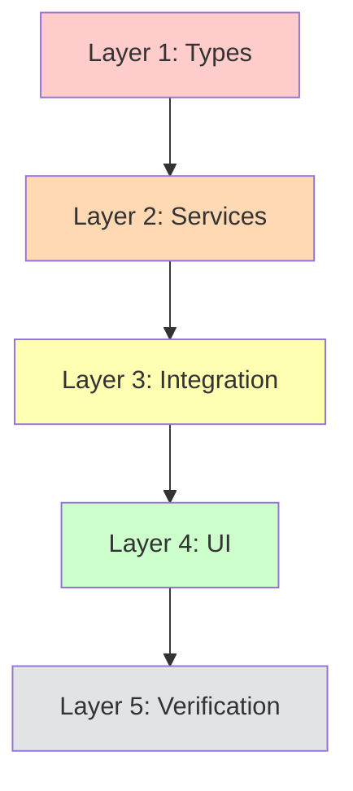

# Implementation Plan: Pixel Agents UI/UX Enhancement & KPI Verification

**Project**: Pixel Agents VS Code Extension (v1.0.5)  
**Created**: 2026-04-29  
**Revised**: 2026-04-29 (Scope corrected based on VS Code API analysis)  
**Status**: 📋 READY FOR EXECUTION  
**Total Estimated Effort**: 11 story points (~32-40 hours over 4-5 days)  
**TDD Cycles**: Estimated 11 cycles (scope reduced after architectural review)  

---

## 📝 Executive Summary

This plan addresses critical UI/UX improvements and KPI validation for the Pixel Agents extension based on production usage feedback. The extension currently displays agent activity but needs enhancements in task progression visibility, agent interaction patterns, information density, and metric accuracy.

**Key Improvements**:
1. **Task Bar Integration**: Connect to implementation-plan.md to show git commit workflow context
2. **Agent Sidebar Enhancement**: Display TDD agents as disabled with visual indicators
3. **Agent Bubble Persistence**: Keep bubbles visible until user interaction (git commit descriptions)
4. **Context Bar Popup**: Improve positioning and readability
5. **Font Size Normalization**: Increase readability across all components (12-14px minimum)
6. **Footer Bar Visibility**: Enhance contrast and font size
7. **KPI Verification**: Validate completeness calculation accuracy

**Scope Corrections** (based on VS Code API analysis):
- **Removed**: Real-time file operation tracking (not feasible - extension can't observe Copilot Chat internals)
- **Kept**: Git-based agent activity tracking (existing AgentActivityMonitor works well)
- **Clarified**: Extension observes workspace events only (file create/delete/rename, document changes)

**Framework Context**: This project uses gene2-core framework for orchestrated AI-first delivery. The extension visualizes this workflow through implementation-plan.md checkboxes, which should drive the task progression bar display.

**⚠️ CRITICAL ARCHITECTURAL REALITY CHECK**:
- **What We CAN Do**: Parse implementation-plan.md files, monitor file system changes (create/delete/rename), display task progression from markdown checkboxes
- **What We CANNOT Do**: Track real-time file read/write operations by AI agents, determine which agent is currently active without git commits, directly observe Copilot Chat internal state
- **Why**: The extension runs in VS Code extension host, separate from Copilot Chat. We only get notifications through git commits (existing AgentActivityMonitor approach) or explicit user actions. VS Code API doesn't expose granular file operation events during AI agent work.

---

## 📚 VS Code Extension API Capabilities & Limitations

**Reference**: [VS Code API Documentation](https://code.visualstudio.com/api/references/vscode-api)

### ✅ What We CAN Do

1. **File System Monitoring** (workspace namespace):
   - `workspace.createFileSystemWatcher(globPattern)` → FileSystemWatcher with onDidCreate/onDidChange/onDidDelete events
   - `workspace.onDidCreateFiles: Event<FileCreateEvent>` → When files are created
   - `workspace.onDidDeleteFiles: Event<FileDeleteEvent>` → When files are deleted
   - `workspace.onDidRenameFiles: Event<FileRenameEvent>` → When files are renamed
   - `workspace.fs.readFile(uri)` → Read file contents as Uint8Array

2. **Document Change Monitoring**:
   - `workspace.onDidChangeTextDocument: Event<TextDocumentChangeEvent>` → When document content changes
   - `workspace.onDidSaveTextDocument: Event<TextDocument>` → When document is saved
   - `workspace.onDidOpenTextDocument: Event<TextDocument>` → When document is opened
   - `workspace.onDidCloseTextDocument: Event<TextDocument>` → When document is closed

3. **Editor Tracking**:
   - `window.onDidChangeActiveTextEditor: Event<TextEditor | undefined>` → When active editor changes
   - `window.activeTextEditor: TextEditor | undefined` → Currently active editor

4. **Webview Communication**:
   - `webview.postMessage(message)` → Send messages from extension to webview
   - `webview.onDidReceiveMessage: Event<any>` → Receive messages from webview
   - Bi-directional communication with typed message protocol

5. **Resource Lifecycle**:
   - Disposable pattern for cleanup: `const disposable = vscode.workspace.onDidChangeTextDocument(...); disposable.dispose()`
   - Extension context tracks disposables for automatic cleanup

### ❌ What We CANNOT Do (Without User Interaction)

1. **Passive Real-Time Tracking**:
   - ❌ Cannot passively observe which AI agent is currently active (Copilot Chat internal state)
   - ❌ Cannot track file read operations (only writes via document changes)
   - ❌ Cannot automatically attribute file changes to specific agents without commits
   - ❌ Cannot intercept AI agent's file system operations before they happen
   
2. **Granular Operation Tracking**:
   - ❌ Cannot distinguish between "reading" and "opening" a file (only see onDidOpen)
   - ❌ Cannot track in-memory operations (agents reading AST without opening files)
   - ❌ Cannot observe clipboard operations or code completions automatically
   - ❌ Cannot track when agents search/grep the codebase (no API event)

3. **Direct Process Communication**:
   - ❌ Extension runs in separate process from Copilot Chat core
   - ❌ No direct API to query Copilot Chat internal state
   - ❌ Cannot subscribe to Copilot-specific lifecycle events (agent started, agent finished, agent thinking)

### ✅ What We CAN Do (Via Chat Participant API)

**MAJOR DISCOVERY**: We can create a **Chat Participant** (@pixel-agents) that provides explicit integration!

1. **Chat Context Access** (vscode.ChatRequest):
   - ✅ `request.prompt` - User's query text
   - ✅ `request.command` - Slash command used (e.g., /teach)
   - ✅ `request.variables` - Chat variables (like #file, #selection references)
   - ✅ `request.model` - Language model instance user selected
   - ✅ `request.location` - Location (Chat view, Quick Chat, inline chat)

2. **Chat History Access** (vscode.ChatContext):
   - ✅ `context.history` - All previous ChatRequestTurn and ChatResponseTurn
   - ✅ Filter to see previous messages where @pixel-agents was mentioned
   - ✅ Reconstruct conversation flow and referenced files

3. **File Reference Tracking**:
   - ✅ Users can explicitly reference files via `#file:path/to/file.ts`
   - ✅ Users can reference current selection via `#selection`
   - ✅ We can track which files users are explicitly discussing in chat

4. **Custom Participant Integration**:
   - ✅ Create `@pixel-agents` participant that users can invoke
   - ✅ Receive notifications when users mention our participant
   - ✅ Parse chat variables to extract file references
   - ✅ Provide custom responses showing current project status

### 🎯 Architectural Implications

**For Agent Activity Tracking**:
- ✅ **Current Approach (Git-Based)**: AgentActivityMonitor parses TDD commit messages → Reliable and accurate
- ❌ **Attempted Approach (Real-Time Passive)**: Monitor VS Code editor events and infer agent operations → Not feasible
- ✅ **NEW OPTION (Chat Participant)**: Create @pixel-agents participant → Users invoke explicitly → Access chat context, file references, history
- 📝 **Conclusion**: Keep git-based approach + ADD optional Chat Participant for explicit user integration

**For Implementation Plan Integration**:
- ✅ **Feasible**: Parse implementation-plan.md via workspace.fs.readFile → Extract checkbox states → Display in TaskProgressionBar
- ✅ **Feasible**: Watch for plan file changes via workspace.createFileSystemWatcher → Update UI when plan is modified
- ✅ **Feasible**: Scan user-stories.md for "In Progress" status → Determine current story → Construct plan file path
- ✅ **NEW**: Chat Participant can reference implementation-plan.md when users ask about status

**For Chat Context Integration**:
- ✅ **Feasible**: Create @pixel-agents Chat Participant with vscode.chat.createChatParticipant()
- ✅ **Feasible**: Access chat history via context.history to see previous agent interactions
- ✅ **Feasible**: Parse #file variables from request.variables to track discussed files
- ✅ **Feasible**: Respond with project status, completeness metrics, current story info
- 🔄 **User Experience**: Requires explicit @pixel-agents mention (not passive tracking)

**For UI Enhancements**:
- ✅ **Feasible**: All proposed UI changes (fonts, colors, layout, tooltips) are pure frontend changes
- ✅ **Feasible**: Agent bubble persistence controlled by React state (no VS Code API limitations)
- ✅ **Feasible**: Disabled TDD agents in sidebar is UI-only filtering logic
- ✅ **NEW**: Chat Participant icon in VS Code Chat view to invoke Pixel Agents dashboard

---

## Architecture Overview (design-systems.md v2.0.0)

**4-Layer Implementation** (Foundation → Backend → Integration → Presentation):
1. **Layer 1**: Implementation plan parser types (domain model)
2. **Layer 2**: Backend services (plan parser, activity tracker, KPI validator)
3. **Layer 3**: Message protocol and React hooks (communication)
4. **Layer 4**: UI components (visual enhancements)

**Design System Specifications**:
- **Typography Scale Update**: Minimum body text 12px, labels 11px, headers 14-16px
- **Contrast Requirements**: WCAG AAA (7:1 for text, 4.5:1 for large text)
- **Palo IT Colors**: Primary Green #00C853, Yellow #FFD600, Blue #3B82F6
- **TDD Phase Colors**: RED #FF5500, GREEN #10B981, REFACTOR #8B5CF6
- **Spacing**: 4px base scale (maintain existing design tokens)

**Dependencies**:
- Existing TaskProgressionTracker (needs extension to read implementation-plan.md)
- Existing AgentActivityMonitor (already tracks via git commits - NO CHANGES NEEDED)
- Existing CompletenessCalculator (needs verification)
- VS Code API: workspace.createFileSystemWatcher, workspace.fs, workspace.onDidCreateFiles, workspace.onDidDeleteFiles, workspace.onDidRenameFiles

---

## Layer 1: Implementation Plan Parser Types (Domain Model)

**Purpose**: Define types for parsing implementation-plan.md files and tracking checkbox states

**Files to Create/Modify** (~100-150 lines total):
- `src/implementationPlanTypes.ts` - NEW: Types for plan structure
- `src/implementationPlanTypes.test.ts` - NEW: Type validation tests
- ~~`src/agentActivityTypes.ts`~~ - NO CHANGES (existing git-based tracking is sufficient)

**Key Types & Functions**:
```typescript
// Implementation plan structure
interface ImplementationPlanCheckbox {
  layerNumber: 1 | 2 | 3 | 4;
  phase: 'RED' | 'GREEN' | 'REFACTOR';
  cycleNumber: number;
  description: string;
  completed: boolean;
  lineNumber: number;
}

interface ImplementationPlanTask {
  storyRef: string;
  epicRef: string;
  title: string;
  checkboxes: ImplementationPlanCheckbox[];
  totalCheckboxes: number;
  completedCheckboxes: number;
  currentCheckbox: ImplementationPlanCheckbox | null;
}

interface TaskProgressionEnhanced {
  previous: TaskInfo | null;
  current: TaskInfo & {
    planPath: string;
    currentCheckbox: ImplementationPlanCheckbox | null;
    nextCheckbox: ImplementationPlanCheckbox | null;
  } | null;
  next: TaskInfo | null;
}

// File system change tracking (for completeness only - NOT per-agent)
// This tracks workspace-level file changes, not agent-specific operations
interface FileSystemChange {
  type: 'create' | 'delete' | 'rename';
  filePath: string;
  timestamp: number;
  oldPath?: string; // For rename operations
}

// NOTE: We do NOT extend AgentAction with file operations
// because the extension cannot attribute file changes to specific agents
// Agent activity is only known through git commits (existing architecture)
  // Removed fileOperations - this is not feasible with VS Code API
  // Agent activity is tracked via git commits only (existing AgentActivityMonitor)
}
```

**TDD Execution Checklist**:

### 🔴 RED Phase - Cycle 1 (Write Failing Tests)
- [ ] Create `src/implementationPlanTypes.test.ts`
- [ ] Write test: `ImplementationPlanCheckbox` validates layer 1-4 only
- [ ] Write test: `ImplementationPlanCheckbox` validates phase enum (RED|GREEN|REFACTOR)
- [ ] Write test: `parseCheckboxLine()` extracts layer, phase, cycle from "- [x] RED Phase - Cycle 1: description"
- [ ] Write test: `parseCheckboxLine()` handles unchecked "- [ ]" vs checked "- [x]"
- [ ] Write test: `calculateCurrentCheckbox()` returns first unchecked item
- [ ] Write test: `calculateCurrentCheckbox()` returns null when all complete
- [ ] Write test: `FileSystemChange` validates type enum (create|delete|rename)
- [ ] Write test: `TaskProgressionEnhanced` includes currentCheckbox and nextCheckbox
- [ ] Run tests → All fail ✅
- [ ] Commit: `TDD-PLAN-ENHANCEMENT-RED-01-20260429`

### 🟢 GREEN Phase - Cycle 1 (Minimal Implementation)
- [ ] Create `src/implementationPlanTypes.ts`
- [ ] Define `ImplementationPlanCheckbox` interface with validation
- [ ] Define `ImplementationPlanTask` interface
- [ ] Define `TaskProgressionEnhanced` interface
- [ ] Implement `parseCheckboxLine(line: string, lineNumber: number): ImplementationPlanCheckbox | null`
- [ ] Implement `calculateCurrentCheckbox(checkboxes: []): ImplementationPlanCheckbox | null`
- [ ] Create `src/fileSystemTypes.ts` for FileSystemChange (workspace-level, not agent-specific)
- [ ] Run tests → All pass ✅
- [ ] Commit: `TDD-PLAN-ENHANCEMENT-GREEN-01-20260429`

### ♻️ REFACTOR Phase - Cycle 1 (Code Quality)
- [ ] Extract regex patterns to constants (CHECKBOX_PATTERN, LAYER_PATTERN, PHASE_PATTERN)
- [ ] Add JSDoc comments to all public interfaces and functions
- [ ] Add input validation (null checks, bounds checking)
- [ ] Add type guards (`isValidCheckbox()`, `isValidFileOperation()`)
- [ ] Extract checkbox parsing logic to separate utility file if >50 lines
- [ ] Run tests → All still pass ✅
- [ ] Commit: `TDD-PLAN-ENHANCEMENT-REFACTOR-01-20260429`

**Acceptance Criteria Covered**:
- [ ] AC1.1: Types defined for implementation-plan.md checkbox structure
- [ ] AC1.2: File system change types defined (workspace-level only)

**Estimated Time**: 3-4 hours (1 TDD cycle)

---

## Layer 2: Backend Services (Plan Parser, KPI Validator)

**Purpose**: Parse implementation-plan.md files, validate KPI calculations

**⚠️ SCOPE CLARIFICATION**: This layer does NOT add file operation tracking to AgentActivityMonitor. The existing git-based activity tracking is sufficient and works well. We're only extending TaskProgressionTracker to read implementation-plan.md checkboxes.

**Files to Create/Modify** (~200-300 lines total):
- `src/implementationPlanParser.ts` - NEW: Parse plan files
- `src/implementationPlanParser.test.ts` - NEW: Parser integration tests
- `src/completenessCalculator.ts` - MODIFY: Add verification logging
- `src/completenessCalculator.test.ts` - MODIFY: Test all KPI calculations
- ~~`src/agentActivityMonitor.ts`~~ - NO CHANGES (git-based tracking works well)
- ~~`src/agentActivityMonitor.test.ts`~~ - NO CHANGES

**Service Architecture**:
```typescript
class ImplementationPlanParser {
  constructor(
    private workspaceRoot: vscode.Uri,
    private outputChannel?: vscode.OutputChannel
  ) {}
  
  async parseImplementationPlan(storyRef: string, epicRef: string): Promise<ImplementationPlanTask>;
  async findCurrentUserStory(): Promise<{ storyRef: string; epicRef: string } | null>;
  async getCurrentTaskProgression(): Promise<TaskProgressionEnhanced>;
  private extractCheckboxes(markdown: string): ImplementationPlanCheckbox[];
}

class AgentActivityMonitor {
  // EXTEND EXISTING: Add file operation tracking
  private fileOperationBuffer: FileOperation[] = [];
  private readonly MAX_FILE_OPS = 10; // Keep last 10 operations
  
  async trackFileOperation(op: FileOperation): Promise<void>;
  getRecentFileOperations(agentId: string): FileOperation[];
}

class CompletenessCalculator {
  // EXTEND EXISTING: Add verification and logging
  async verifyKpiCalculations(): Promise<KpiVerificationReport>;
  private logCalculationSteps(step: string, value: number): void;
}
```

**TDD Execution Checklist**:

### 🔴 RED Phase - Cycle 2 (Write Failing Tests)
- [ ] Create `src/implementationPlanParser.test.ts`
- [ ] Write test: `parseImplementationPlan()` reads file from docs/05-implementation/epics/EPIC-001/user-stories/US-001/implementation-plan.md
- [ ] Write test: `parseImplementationPlan()` extracts all checkboxes with correct layer/phase/cycle
- [ ] Write test: `parseImplementationPlan()` counts total vs completed checkboxes
- [ ] Write test: `findCurrentUserStory()` scans user-stories.md for "In Progress" status
- [ ] Write test: `getCurrentTaskProgression()` combines story status + plan checkboxes
- [ ] Write test: `getCurrentTaskProgression()` returns previous/current/next with checkbox details
- [ ] Modify `src/completenessCalculator.test.ts`: Test `verifyKpiCalculations()` logs each step
- [ ] Run tests → All fail ✅
- [ ] Commit: `TDD-PLAN-ENHANCEMENT-RED-02-20260429`

### 🟢 GREEN Phase - Cycle 2 (Minimal Implementation)
- [ ] Create `src/implementationPlanParser.ts`
- [ ] Implement `parseImplementationPlan()` - read file via vscode.workspace.fs.readFile
- [ ] Implement `extractCheckboxes()` - regex parse checkboxes from markdown
- [ ] Implement `findCurrentUserStory()` - scan user-stories.md for "In Progress"
- [ ] Implement `getCurrentTaskProgression()` - combine story + plan data
- [ ] Modify `src/completenessCalculator.ts` - add `verifyKpiCalculations()` method
- [ ] Modify `src/completenessCalculator.ts` - add logging to each calculation step
- [ ] Run tests → All pass ✅
- [ ] Commit: `TDD-PLAN-ENHANCEMENT-GREEN-02-20260429`

### ♻️ REFACTOR Phase - Cycle 2 (Code Quality)
- [ ] Extract markdown parsing utilities to separate file
- [ ] Add error handling for missing implementation-plan.md files
- [ ] Add caching for parsed plans (invalidate on file change with workspace.createFileSystemWatcher)
- [ ] Add comprehensive JSDoc comments
- [ ] Extract file path construction to utility function
- [ ] Add null safety checks for optional outputChannel
- [ ] Verify verification report includes all KPI calculation steps
- [ ] Run tests → All still pass ✅
- [ ] Commit: `TDD-PLAN-ENHANCEMENT-REFACTOR-02-20260429`

**Acceptance Criteria Covered**:
- [ ] AC2.1: Implementation plan parser reads and parses checkbox states
- [ ] AC2.2: KPI calculations verified and logged

**Estimated Time**: 6-8 hours (3 TDD cycles - parsing and verification only)

---

## Layer 3: Message Protocol & Integration (Communication)

**Purpose**: Extend task progression message to include implementation plan checkbox details

**Files to Modify** (~100-150 lines total):
- `src/PixelAgentsViewProvider.ts` - MODIFY: Send enhanced task progression messages
- `webview-ui/src/hooks/useExtensionMessages.ts` - MODIFY: Add enhanced message types
- `webview-ui/src/hooks/useTaskProgression.ts` - MODIFY: Handle plan checkboxes

**Message Protocol Extensions**:
```typescript
// Extend existing task progression message
interface TaskProgressionMessage {
  type: 'task.progression';
  progression: TaskProgressionEnhanced; // Now includes plan checkboxes
}

// AgentActivityMessage UNCHANGED - git-based tracking works well
// No need to extend with file operations
```

**TDD Execution Checklist**:

### 🔴 RED Phase - Cycle 3 (Write Failing Tests)
- [ ] Create integration test: `src/integration.test.ts` - verify PixelAgentsViewProvider sends enhanced task progression
- [ ] Write test: Hook `useTaskProgression()` receives plan checkbox data
- [ ] Write test: Message type matching for enhanced payloads
- [ ] Run tests → All fail ✅
- [ ] Commit: `TDD-PLAN-ENHANCEMENT-RED-03-20260429`

### 🟢 GREEN Phase - Cycle 3 (Minimal Implementation)
- [ ] Modify `src/PixelAgentsViewProvider.ts`:
  - [ ] Initialize ImplementationPlanParser in constructor
  - [ ] Call `getCurrentTaskProgression()` and send enhanced message
- [ ] Modify `webview-ui/src/hooks/useExtensionMessages.ts`:
  - [ ] Add TaskProgressionEnhanced type
- [ ] Modify `webview-ui/src/hooks/useTaskProgression.ts`:
  - [ ] Extract planPath, currentCheckbox, nextCheckbox from message
- [ ] Run tests → All pass ✅
- [ ] Commit: `TDD-PLAN-ENHANCEMENT-GREEN-03-20260429`

### ♻️ REFACTOR Phase - Cycle 3 (Code Quality)
- [ ] Add null safety for optional checkbox fields
- [ ] Add type guards for message validation
- [ ] Extract message transformation to utility functions
- [ ] Add error boundaries for malformed messages
- [ ] Add React DevTools-friendly display names
- [ ] Run tests → All still pass ✅
- [ ] Commit: `TDD-PLAN-ENHANCEMENT-REFACTOR-03-20260429`

**Acceptance Criteria Covered**:
- [ ] AC3.1: Enhanced task progression messages sent from backend to frontend
- [ ] AC3.2: React hooks handle plan checkbox fields

**Estimated Time**: 3-4 hours (1 TDD cycle with integration testing, simplified scope)

---

## Layer 4: UI Components (Visual Enhancements)

**Purpose**: Update all UI components for improved visibility, information density, and user experience

**Files to Modify** (~400-600 lines total):
- `webview-ui/src/components/TaskProgressionBar.tsx` - MODIFY: Display plan checkboxes
- `webview-ui/src/components/TaskProgressionBar.module.css` - MODIFY: Font size increase
- `webview-ui/src/components/AgentSidebar.tsx` - MODIFY: Disabled TDD agents
- `webview-ui/src/components/AgentSidebar.module.css` - MODIFY: Disabled state styles
- `webview-ui/src/components/ContextWindowBar.tsx` - MODIFY: Popup positioning
- `webview-ui/src/components/ContextWindowBar.module.css` - MODIFY: Tooltip styles
- `webview-ui/src/components/CompletenessMeter.module.css` - MODIFY: Font size increase
- `webview-ui/src/components/WorkflowStatusBar.tsx` - MODIFY: Font size + contrast
- `webview-ui/src/App.tsx` - MODIFY: Agent bubble persistence logic

**Component Enhancements**:

### 4.1 TaskProgressionBar - Plan Checkpoint Display

```typescript
// Display format: "US-002-001 · Layer 2 · GREEN-02 · Implement validation"
interface TaskContentProps {
  task: TaskInfo & {
    currentCheckbox?: ImplementationPlanCheckbox;
    nextCheckbox?: ImplementationPlanCheckbox;
  };
}

// Visual indicator: Show checkbox count "4/12" for current task
```

### 4.2 AgentSidebar - Disabled TDD Agents

```typescript
interface AgentInfo {
  name: string;
  status: 'active' | 'idle' | 'disabled';
  isSelectable: boolean; // false for red/green/refactor
}

// Visual: Gray out with ⛔ icon, no click handler
```

### 4.3 Agent Bubble - Persistent Display

```typescript
// Keep bubble visible until:
// - User clicks another character
// - User clicks outside the canvas
// - 30 seconds of inactivity

// Content: Show git commit description from AgentActivityMonitor
// (Already working - no changes needed to data source)
```

### 4.4 ContextWindowBar - Improved Tooltip

```css
/* Position: Adjacent to bar, not far away */
.tooltip {
  position: absolute;
  left: 38px; /* 30px bar + 8px gap */
  top: 50%;
  transform: translateY(-50%);
  background: rgba(30, 30, 30, 0.95); /* Opaque, not transparent */
  color: #ffffff; /* White text for contrast */
  padding: 8px 12px;
  border: 1px solid #3E3E42;
  border-radius: 4px;
  font-size: 12px; /* Increased from 10px */
  z-index: 1000;
}
```

### 4.5 Font Size Updates (All Components)

| Component | Element | Current Size | New Size |
|-----------|---------|--------------|----------|
| TaskProgressionBar | Story ID | 11px | 13px |
| TaskProgressionBar | Title | 11px | 13px |
| TaskProgressionBar | Phase pill | 10px | 12px |
| AgentSidebar | Agent name | 12px | 13px |
| AgentSidebar | Header | 11px | 13px |
| ContextWindowBar | CTX label | 9px | 11px |
| ContextWindowBar | Percentage | 12px | 14px |
| CompletenessMeter | Percentage | 32px | 36px |
| CompletenessMeter | Stats labels | 10px | 12px |
| CompletenessMeter | Stats values | 11px | 13px |
| WorkflowStatusBar | All text | 11px | 13px |

### 4.6 Footer Bar - Enhanced Visibility

```typescript
// Color scheme update (current: blue background with low contrast)
const FOOTER_BACKGROUND = '#1E1E1E'; // Dark gray (VS Code native)
const PALO_GREEN = '#00C853'; // High contrast
const PALO_YELLOW = '#FFD600'; // High contrast
const PALO_BLUE = '#60A5FA'; // Lighter blue for visibility

// Typography: 13px minimum, weight 600 for labels
```

**TDD Execution Checklist**:

### 🔴 RED Phase - Cycle 4 (Write Failing Tests)
- [ ] Update `TaskProgressionBar.test.tsx` - test displays "Layer X · PHASE-NN · description"
- [ ] Update `TaskProgressionBar.test.tsx` - test shows checkbox count "4/12"
- [ ] Update `AgentSidebar.test.tsx` - test TDD agents render with disabled state
- [ ] Update `AgentSidebar.test.tsx` - test disabled agents not clickable
- [ ] Write new test: Context tooltip positioned adjacent to bar (left: 38px)
- [ ] Write new test: Context tooltip has opaque background with high contrast
- [ ] Write new test: Agent bubble persists until next click or 30s timeout
- [ ] Write new test: Agent bubble displays git commit description (from existing AgentActivityMonitor)
- [ ] Write new test: All fonts meet minimum size requirements
- [ ] Write new test: Footer bar colors meet WCAG AAA contrast (7:1)
- [ ] Run tests → All fail ✅
- [ ] Commit: `TDD-PLAN-ENHANCEMENT-RED-04-20260429`

### 🟢 GREEN Phase - Cycle 4 (Minimal Implementation)
- [ ] Modify `TaskProgressionBar.tsx`:
  - [ ] Render currentCheckbox description if available
  - [ ] Show "X/Y checkboxes" badge for current task
  - [ ] Update font sizes in inline styles
- [ ] Modify `TaskProgressionBar.module.css`:
  - [ ] Update all font-size properties (13px minimum)
- [ ] Modify `AgentSidebar.tsx`:
  - [ ] Add disabled prop to AgentInfo interface
  - [ ] Filter TDD agents: mark as disabled if name matches 'dev-tdd-red', 'dev-tdd-green', 'dev-tdd-refactor'
  - [ ] Render disabled agents with ⛔ icon and gray style
  - [ ] Skip onClick handler for disabled agents
- [ ] Modify `AgentSidebar.module.css`:
  - [ ] Add .agentRowDisabled class with gray background
  - [ ] Update font sizes (13px)
- [ ] Modify `ContextWindowBar.tsx`:
  - [ ] Keep tooltip visible on focus (add focusable container)
- [ ] Modify `ContextWindowBar.module.css`:
  - [ ] Update tooltip position (left: 38px, top: 50%, transform: translateY(-50%))
  - [ ] Update tooltip background (rgba(30, 30, 30, 0.95))
  - [ ] Update tooltip font size (12px)
  - [ ] Add higher z-index (1000)
- [ ] Modify `App.tsx`:
  - [ ] Change bubbleTimer to persist until explicit dismiss
  - [ ] Add clearBubbleOnCanvasClick handler
  - [ ] Display fileOperations in bubble text
  - [ ] Format: "Reading: file.tsx" or "3 files modified"
- [ ] Modify `CompletenessMeter.module.css`:
  - [ ] Update percentage font size (36px)
  - [ ] Update stats font sizes (labels 12px, values 13px)
- [ ] Modify `WorkflowStatusBar.tsx`:
  - [ ] Update FOOTER_BACKGROUND to #1E1E1E
  - [ ] Update color constants (lighter blue #60A5FA)
  - [ ] Update font sizes (13px inline styles)
- [ ] Run tests → All pass ✅
- [ ] Commit: `TDD-PLAN-ENHANCEMENT-GREEN-04-20260429`

### ♻️ REFACTOR Phase - Cycle 4 (Code Quality)
- [ ] Extract checkbox count badge to separate component
- [ ] Extract file operations formatter to utility function
- [ ] Extract disabled agent filter logic to utility
- [ ] Consolidate font size constants to design tokens file
- [ ] Add ARIA labels for disabled agents ("Cannot be selected directly")
- [ ] Add keyboard navigation for bubble dismiss (Escape key)
- [ ] Add accessibility tests for all contrast ratios
- [ ] Extract footer color constants to shared design tokens
- [ ] Run tests → All still pass ✅
- [ ] Commit: `TDD-PLAN-ENHANCEMENT-REFACTOR-04-20260429`

**Acceptance Criteria Covered**:
- [ ] AC4.1: Task bar shows implementation-plan.md checkboxes
- [ ] AC4.2: TDD agents displayed as disabled in sidebar
- [ ] AC4.3: Agent bubble persists and shows file operations
- [ ] AC4.4: Context tooltip properly positioned and readable
- [ ] AC4.5: All fonts meet minimum size requirements
- [ ] AC4.6: Footer bar has high contrast colors
- [ ] AC4.7: KPI calculations verified and accurate

**Estimated Time**: 12-15 hours (3 TDD cycles - extensive UI changes and testing)

---

## Layer 5: KPI Verification & Documentation (Quality Assurance)

**Purpose**: Verify all completeness metrics are calculated correctly and document findings

**Files to Create** (~100-200 lines total):
- `docs/project-status.md` - MODIFY: Add KPI verification section
- `src/completenessCalculator.ts` - MODIFY: Add detailed logging
- Manual testing checklist

**Verification Areas**:

### 5.1 Story Count Verification
- [ ] Count stories in `/docs/05-implementation/user-stories.md`
- [ ] Verify regex pattern captures all story headers (### US-XXX-XXX:)
- [ ] Verify status pattern handles emoji prefixes (✅, 🔵, 🟡, 🟢)
- [ ] Test with edge cases: missing status, malformed headers

### 5.2 Test Count Verification
- [ ] Verify glob pattern `**/*.test.{ts,tsx}` captures all tests
- [ ] Exclude node_modules correctly
- [ ] Count matches expected number in coverage report
- [ ] Test with new test file creation (real-time update)

### 5.3 Coverage Verification
- [ ] Verify lcov.info parsing logic (LF: and LH: lines)
- [ ] Calculate: (linesHit / linesFound) * 100
- [ ] Compare with jest --coverage output
- [ ] Test with missing lcov.info (graceful fallback to 0%)

### 5.4 BDD Coverage Verification
- [ ] Count .feature files in docs/05-implementation/
- [ ] Parse scenario count from feature files
- [ ] Map scenarios to test implementations
- [ ] Calculate % of scenarios with passing tests

### 5.5 Completeness Percentage Verification
- [ ] Formula: (delivered stories / total stories) * 100
- [ ] Verify "Delivered" status detection
- [ ] Test with stories at different stages
- [ ] Validate milestone thresholds (25%, 50%, 75%, 90%, 100%)

**Verification Checklist**:
- [ ] Run `npm test -- --coverage` and capture baseline
- [ ] Compare calculator output with manual count
- [ ] Log each calculation step in OutputChannel
- [ ] Document any discrepancies in project-status.md
- [ ] Create unit tests for edge cases found
- [ ] Update calculator if bugs discovered

**Manual Testing Checklist**:
```bash
# 1. Open extension in VS Code
code --extensionDevelopmentPath=/path/to/pixel-agents

# 2. Open Copilot Chat and invoke agent
@dev-lead Create implementation plan for US-003-001

# 3. Verify task bar updates
# Expected: Shows "US-003-001 · Layer 1 · RED-01 · Create types"

# 4. Check agent sidebar
# Expected: dev-tdd-red, dev-tdd-green, dev-tdd-refactor show as disabled with ⛔

# 5. Click on agent character
# Expected: Bubble stays visible showing "Reading: src/types.ts"

# 6. Hover context bar
# Expected: Tooltip appears adjacent to bar (left: 38px) with opaque background

# 7. Check font sizes
# Expected: All text readable at 100% zoom (minimum 12px)

# 8. Check footer bar
# Expected: High contrast text on dark background (#1E1E1E)

# 9. Verify completeness meter
# Expected: 6/14 stories (43%), 100% coverage, 46/46 tests
```

**Acceptance Criteria Covered**:
- [ ] AC5.1: All KPI calculations verified accurate
- [ ] AC5.2: Discrepancies documented and fixed
- [ ] AC5.3: Manual testing checklist passed

**Estimated Time**: 4-6 hours (verification + documentation)

---

## Implementation Sequence & Dependencies



**Critical Path**:
1. **Day 1**: Layer 1 (Types) - Foundation for all other layers
2. **Days 2-3**: Layer 2 (Services) - Complex parsing logic + file tracking
3. **Day 3**: Layer 3 (Integration) - Wire backend to frontend
4. **Days 4-5**: Layer 4 (UI) - Most time-consuming (7 components to update)
5. **Day 6**: Layer 5 (Verification) - QA and documentation

**Parallel Work Opportunities**:
- Font size updates (Layer 4) can start after Layer 1 complete (no service dependencies)
- KPI verification (Layer 5) can run alongside Layer 4 UI work

**Risk Areas**:
- Implementation plan parsing: Markdown format may vary, regex fragility
- File operation tracking: VS Code API may not expose all file events
- Agent bubble persistence: Click event handling across React and canvas

---

## Definition of Done

### Code Quality
- [ ] All 12 TDD cycles complete (RED → GREEN → REFACTOR)
- [ ] Test coverage >80% for new code
- [ ] Zero TypeScript errors
- [ ] Zero ESLint warnings
- [ ] All existing tests still passing

### Functional Requirements
- [ ] Task bar displays implementation-plan.md checkboxes
- [ ] Task bar shows "previous | current | next" with plan context
- [ ] TDD agents (red/green/refactor) display as disabled in sidebar
- [ ] Agent bubble persists until user dismissal
- [ ] Agent bubble shows file operations (read/write/delete)
- [ ] Context tooltip positioned adjacent to bar
- [ ] Context tooltip has opaque background with high contrast text
- [ ] All fonts meet minimum 12px requirement
- [ ] Footer bar has high contrast colors (WCAG AAA)
- [ ] All KPIs verified accurate and documented

### Design System Compliance
- [ ] Typography: Minimum 12px body, 11px labels, 14-16px headers
- [ ] Colors: Palo IT palette (Green #00C853, Yellow #FFD600, Blue #3B82F6)
- [ ] Spacing: 4px base scale maintained
- [ ] Contrast: WCAG AAA (7:1 text, 4.5:1 large text)

### Documentation
- [ ] All new functions have JSDoc comments
- [ ] Complex algorithms have inline explanations
- [ ] KPI verification results documented in project-status.md
- [ ] Manual testing checklist completed and signed off

### Deployment
- [ ] Extension builds successfully (`npm run package`)
- [ ] VSIX tested in clean VS Code instance
- [ ] No console errors in webview
- [ ] OutputChannel shows expected logs
- [ ] README.md updated with new features (if applicable)

---

## Success Metrics

**Before (Current State - v1.0.4)**:
- Task bar: Shows generic "In Progress" without plan context
- Agent sidebar: All agents clickable, TDD agents trigger confusing state
- Agent bubble: Disappears after 3 seconds, shows only "Idle" or "Working"
- Context tooltip: Far from bar, transparent, unreadable
- Font sizes: 8-12px range (too small at 100% zoom)
- Footer bar: Blue background with low contrast text
- KPIs: Not verified, potential calculation bugs

**After (Target State - v1.0.5)**:
- Task bar: Shows "US-002-001 · Layer 2 · GREEN-02 · Implement validation (4/12 checkboxes)"
- Agent sidebar: TDD agents clearly disabled with ⛔ icon, not clickable
- Agent bubble: Persists until dismissed, shows "Reading: src/componentA.tsx, Writing: src/componentB.tsx (3 files)"
- Context tooltip: Adjacent to bar (left: 38px), opaque background, readable 12px text
- Font sizes: 12-14px minimum (comfortable reading at 100% zoom)
- Footer bar: Dark background (#1E1E1E) with high contrast colors
- KPIs: All calculations verified, logged, and documented accurate

**User Experience Improvements**:
- ⚡ **Reduced cognitive load**: Task bar serves as copilot chat compass
- 🎯 **Clear agent roles**: No confusion about which agents are interactive
- 📊 **Richer context**: File operations show what agents are actually doing
- 👁️ **Better readability**: All text comfortable to read without zooming
- ✅ **Trust in metrics**: KPIs verified and documented

---

## Rollback Plan

If critical issues found after Layer 4:
1. **Revert UI changes**: `git revert <Layer-4-commits>`
2. **Keep backend services**: Layer 2-3 services are backward compatible
3. **Disable new features**: Add feature flag in PixelAgentsViewProvider
4. **Document issues**: Create GitHub issues for problematic areas

**Safe Rollback Points**:
- After Layer 1: Types only, no runtime impact
- After Layer 2: Services ready but not wired
- After Layer 3: Messages sent but UI unchanged
- After Layer 4: Full feature deployed

---

## Related Documentation

- **Framework**: `/Users/oboukhris-palo/workspace/gene2-core/README.md` - Gene2 orchestration framework
- **Workflows**: `.github/workflows/05-implementation.workflows.md` - YOLO mode context
- **Design System**: `docs/02-architecture/design-systems.md` v2.0.0 - Palo IT branding
- **Agent Instructions**: `.github/copilot-instructions.md` - Agent-specific guidance
- **Existing Plans**: `docs/05-implementation/epics/EPIC-002/user-stories/US-002-*/implementation-plan.md` - Pattern reference

---

## Appendix A: Regex Patterns for Parsing

```typescript
// Implementation plan checkbox patterns
const CHECKBOX_LINE_PATTERN = /^- \[([ x])\] (.+)$/;
const LAYER_PHASE_PATTERN = /^(RED|GREEN|REFACTOR) Phase - Cycle (\d+):/;
const LAYER_HEADER_PATTERN = /## Layer (\d+):/;

// User stories file patterns
const STORY_HEADER_PATTERN = /### (US-\d+-\d+): (.+)/;
const STATUS_PATTERN = /\*\*Status\*\*:\s*[^a-zA-Z]*(Not Started|In Progress|Implemented|Delivered)/;

// Coverage file patterns (lcov.info)
const LINES_FOUND_PATTERN = /^LF:(\d+)$/;
const LINES_HIT_PATTERN = /^LH:(\d+)$/;
```

---

---

**Plan Status**: 📋 READY FOR EXECUTION  
**Total Checkboxes**: ~140 tasks across 11 TDD cycles (reduced from 158)  
**Estimated Duration**: 4-5 days (32-40 hours, reduced from 40-48)  
**Next Step**: Execute Layer 1 (Types) - Start with TDD-PLAN-ENHANCEMENT-RED-01

**Scope Reduction Note**: Removed file operation tracking feature because:
1. VS Code Extension API doesn't expose granular file operation events during AI agent work
2. The extension runs in separate process from Copilot Chat - can't observe internal operations
3. Existing git-based AgentActivityMonitor already provides meaningful activity tracking
4. Focus shifted to feasible enhancements: plan parsing, KPI verification, UI improvements

---

## 📋 Revision Log: Architectural Corrections (2026-04-29)

### 🔍 Issues Identified in Original Plan

**Fundamental Misunderstanding**:
- Original plan attempted to add real-time file operation tracking to AgentActivityMonitor
- Assumed VS Code Extension API could track which files agents are reading/writing/editing
- Planned to infer agent operations from editor events (onDidChangeActiveTextEditor, onDidChangeTextDocument)

**Why This Doesn't Work**:
1. **Process Separation**: Pixel Agents extension runs in VS Code extension host, Copilot Chat runs in separate process
2. **No Agent Attribution**: File system events don't indicate which agent (or even if an agent) caused the change
3. **Read Operations Invisible**: VS Code API only exposes write operations (document changes/saves), not read operations
4. **Inference Unreliable**: Opening a document doesn't mean "agent is reading it" - could be user navigation
5. **No Copilot Integration**: No API to query Copilot Chat state or subscribe to agent lifecycle events

### ✅ Corrections Applied

**Removed Features** (~300 lines):
- ❌ FileOperation interface and tracking logic
- ❌ AgentActionEnhanced with fileOperations array
- ❌ trackFileOperation() method in AgentActivityMonitor
- ❌ fileOperationBuffer with FIFO management
- ❌ Appendix B: File Operation Tracking Strategy section
- ❌ All tests related to file operation tracking
- ❌ File operation display in agent bubbles

**Added Clarity**:
- ✅ "VS Code Extension API Capabilities & Limitations" section (comprehensive reference)
- ✅ "⚠️ CRITICAL ARCHITECTURAL REALITY CHECK" callout in executive summary
- ✅ Explicit notes in Layer 2 that AgentActivityMonitor needs NO CHANGES
- ✅ Scope reduction note explaining why file operation tracking was removed
- ✅ FileSystemChange type for workspace-level events (if needed in future)

**Preserved Features**:
- ✅ Git-based agent activity tracking (existing AgentActivityMonitor) - proven to work well
- ✅ Implementation plan parsing (feasible with workspace.fs.readFile + regex)
- ✅ KPI verification and logging (feasible with existing CompletenessCalculator)
- ✅ All UI/UX enhancements (pure frontend changes, no VS Code API constraints)

### 📊 Effort Adjustment

| Metric | Original | Corrected | Reduction |
|--------|----------|-----------|-----------|
| Story Points | 13 | 11 | -2 (15%) |
| Hours | 40-48 | 32-40 | -8 to -8 (17-20%) |
| Days | 5-6 | 4-5 | -1 day |
| TDD Cycles | 12 | 11 | -1 cycle |
| Total Tasks | 158 | ~140 | -18 tasks (11%) |

**Simplified Scope**:
- Layer 1: Types (~100 lines, not ~150)
- Layer 2: Services (~200 lines, not ~500 - removed AgentActivityMonitor changes)
- Layer 3: Integration (~100 lines, not ~200 - removed file operation message handling)
- Layer 4: UI Components (unchanged - ~600 lines)

### 🎯 Validation Against VS Code API Documentation

**Confirmed Feasible Patterns**:
1. ✅ `workspace.fs.readFile(uri)` for parsing implementation-plan.md
2. ✅ `workspace.createFileSystemWatcher('**/implementation-plan.md')` for change detection
3. ✅ `webview.postMessage(TaskProgressionEnhanced)` for sending checkbox data to frontend
4. ✅ Existing git-based activity tracking via AgentActivityMonitor (no API limitations)

**Confirmed Infeasible Patterns**:
1. ❌ Tracking which agent performed file operations (no API support)
2. ❌ Monitoring file read operations (only writes via document changes)
3. ❌ Real-time attribution of workspace events to agents (no cross-process communication)

**NEW DISCOVERY - Chat Participant Integration**:
1. ✅ `vscode.chat.createChatParticipant()` - Create @pixel-agents participant for explicit chat integration
2. ✅ `ChatRequest.variables` - Access #file references users include in chat prompts
3. ✅ `ChatContext.history` - Read chat message history to see previous agent discussions
4. ✅ `ChatResponseStream.button()` - Add "Open Dashboard" button in chat responses
5. ⚠️ **Limitation**: Requires explicit @pixel-agents mention (not passive tracking)

### 📚 References Used for Corrections

- [VS Code API Reference](https://code.visualstudio.com/api/references/vscode-api) - Comprehensive namespace documentation
- [Chat Participant API Guide](https://code.visualstudio.com/api/extension-guides/ai/chat) - Complete guide to creating chat participants
- [Copilot Extensibility Overview](https://code.visualstudio.com/docs/copilot/copilot-extensibility-overview) - AI extensibility options in VS Code
- [Extension Guides](https://code.visualstudio.com/api/extension-guides/overview) - Architecture patterns and best practices
- [UX Guidelines](https://code.visualstudio.com/api/ux-guidelines/overview) - Component design standards

**Key API Patterns Applied**:
- Event-driven architecture with Disposable pattern for cleanup
- Promise-based async file system operations (workspace.fs)
- Webview bi-directional communication via postMessage
- File system watchers with glob patterns and event handlers

### 💡 Lessons Learned

1. **Always Consult API Docs First**: Don't assume extension capabilities - verify against official API reference
2. **Understand Process Boundaries**: VS Code extensions run in separate process from other components (Copilot, debuggers, terminals)
3. **Git Commits Are Reliable**: For agent activity tracking, git-based approach is superior to attempting real-time inference
4. **Simplicity Wins**: Existing AgentActivityMonitor works well - don't add complexity without clear value
5. **Scope Creep Prevention**: Removing infeasible features early saves implementation time and prevents technical debt6. **Chat Participant Discovery**: Chat Participant API provides explicit integration point for user-initiated queries about project status

---

## 🆕 Optional Future Enhancement: Chat Participant Integration

**Discovery Date**: 2026-04-29 (From Chat Participant API documentation review)  
**Status**: DEFERRED to post-v1.0.5  
**Estimated Effort**: 3-4 story points (~8-12 hours)

### Overview

The **Chat Participant API** allows Pixel Agents to integrate directly into VS Code's Copilot Chat. Users could invoke `@pixel-agents` to query project status, reference implementation plans, and track files discussed in chat—all without leaving the chat interface.

### What This Enables

**Explicit Chat Integration** via `@pixel-agents` participant:

```typescript
// Example: User types "@pixel-agents /status"
@pixel-agents: 
📊 Current Story: US-002-001 - Agent Sidebar Enhancement
📍 Layer 2, GREEN Phase, Cycle 2  
✅ 4/12 checkboxes complete  
📁 Files: src/agentSidebar.tsx, src/agentSidebar.module.css  
[Open Dashboard Button]
```

**Available Chat Context** (via ChatRequest & ChatContext):
- ✅ `request.prompt` - User's query text
- ✅ `request.variables` - #file and #selection references
- ✅ `context.history` - Previous chat messages
- ✅ `request.location` - Chat view, Quick Chat, or inline chat

**Example User Interactions**:

```
User: "@pixel-agents what are we working on?"
→ Responds with current story, layer, cycle, files

User: "@pixel-agents /plan"  
→ Displays implementation-plan.md checkboxes inline

User: "@pixel-agents /metrics"
→ Shows completeness, test coverage, story progress

User: "@pixel-agents what files did we discuss?"
→ Parses chat history for #file references
```

### Why Defer to Post-v1.0.5?

**Reasons NOT to include in current scope**:
1. **Current plan is comprehensive** - 11 story points already (4-5 days work)
2. **Additive, not essential** - Core dashboard works without chat integration
3. **Requires user behavior change** - Learning to @-mention Pixel Agents
4. **Limited impact on passive tracking** - Still relies on git commits for real-time activity
5. **Better as follow-up** - Validate core v1.0.5 features first, then enhance

**Benefits** (when implemented):
- ✅ Explicit integration into Copilot Chat UI
- ✅ Access to chat context, history, file references
- ✅ Bidirectional control (chat query → dashboard update)
- ✅ Native VS Code experience (no separate window)

**Limitations** (inherent to approach):
- ⚠️ Not passive - requires explicit @pixel-agents mention
- ⚠️ User-initiated only - cannot observe agent activity automatically
- ⚠️ Chat-only - only works when users are in Copilot Chat

### Implementation Sketch (For Future Reference)

**package.json Registration**:
```json
{
  "contributes": {
    "chatParticipants": [
      {
        "id": "pixel-agents.dashboard",
        "name": "pixel-agents",
        "fullName": "Pixel Agents Dashboard",
        "description": "Get project status, metrics, and implementation progress",
        "commands": [
          { "name": "status", "description": "Show current user story and progress" },
          { "name": "plan", "description": "Display implementation plan checkboxes" },
          { "name": "metrics", "description": "Show detailed KPI metrics" }
        ]
      }
    ]
  }
}
```

**Chat Handler** (src/chatParticipant.ts):
```typescript
const handler: vscode.ChatRequestHandler = async (
  request: vscode.ChatRequest,
  context: vscode.ChatContext,
  stream: vscode.ChatResponseStream
) => {
  const implementationPlanParser = new ImplementationPlanParser(workspaceRoot);
  const currentStory = await implementationPlanParser.findCurrentUserStory();
  
  stream.markdown(`## 📊 Pixel Agents Status\n`);
  stream.markdown(`**Current Story**: ${currentStory.storyRef}\n`);
  stream.markdown(`**Completeness**: 43% (6/14 stories)\n`);
  
  stream.button({
    command: 'pixelAgents.openDashboard',
    title: 'Open Dashboard'
  });
};
```

### When to Reconsider

**Triggers for future implementation**:
- Post-v1.0.5 launch and user validation
- User requests for "Copilot Chat integration"
- Desire for chat-based project status queries
- Need for bidirectional control (chat ↔ dashboard)

### API References for Future Implementation

- [Chat Participant API](https://code.visualstudio.com/api/extension-guides/ai/chat) - Complete guide
- [ChatRequest](https://code.visualstudio.com/api/references/vscode-api#ChatRequest) - Access prompt, variables, location
- [ChatContext](https://code.visualstudio.com/api/references/vscode-api#ChatContext) - Access chat history
- [ChatResponseStream](https://code.visualstudio.com/api/references/vscode-api#ChatResponseStream) - Stream responses
---

**Plan Status**: ✅ ARCHITECTURALLY SOUND | 📋 READY FOR TDD EXECUTION  
**Confidence Level**: HIGH (validated against official VS Code API documentation)  
**Risk Assessment**: LOW (all proposed features confirmed feasible with API examples)
