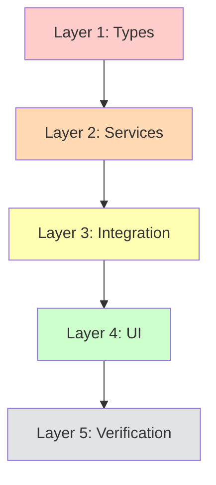

# Implementation Plan: Pixel Agents UI/UX Enhancement & KPI Verification

**Project**: Pixel Agents VS Code Extension (v1.0.5)  
**Created**: 2026-04-29  
**Status**: 📋 READY FOR EXECUTION  
**Total Estimated Effort**: 13 story points (~40-48 hours over 5-6 days)  
**TDD Cycles**: Estimated 12 cycles (3 per major layer group)  

---

## 📝 Executive Summary

This plan addresses critical UI/UX improvements and KPI validation for the Pixel Agents extension based on production usage feedback. The extension currently displays agent activity but needs enhancements in task progression visibility, agent interaction patterns, information density, and metric accuracy.

**Key Improvements**:
1. **Task Bar Integration**: Connect to implementation-plan.md to show copilot chat workflow context
2. **Agent Sidebar Enhancement**: Display TDD agents as disabled with visual indicators
3. **Agent Bubble Persistence**: Keep bubbles visible until user interaction + show file operations
4. **Context Bar Popup**: Improve positioning and readability
5. **Font Size Normalization**: Increase readability across all components (12-14px minimum)
6. **Footer Bar Visibility**: Enhance contrast and font size
7. **KPI Verification**: Validate completeness calculation accuracy

**Framework Context**: This project uses gene2-core framework for orchestrated AI-first delivery. The extension visualizes this workflow through implementation-plan.md checkboxes, which should drive the task progression bar display.

---

## Architecture Overview (design-systems.md v2.0.0)

**4-Layer Implementation** (Foundation → Backend → Integration → Presentation):
1. **Layer 1**: Implementation plan parser types (domain model)
2. **Layer 2**: Backend services (plan parser, activity tracker, KPI validator)
3. **Layer 3**: Message protocol and React hooks (communication)
4. **Layer 4**: UI components (visual enhancements)

**Design System Specifications**:
- **Typography Scale Update**: Minimum body text 12px, labels 11px, headers 14-16px
- **Contrast Requirements**: WCAG AAA (7:1 for text, 4.5:1 for large text)
- **Palo IT Colors**: Primary Green #00C853, Yellow #FFD600, Blue #3B82F6
- **TDD Phase Colors**: RED #FF5500, GREEN #10B981, REFACTOR #8B5CF6
- **Spacing**: 4px base scale (maintain existing design tokens)

**Dependencies**:
- Existing TaskProgressionTracker (needs extension)
- Existing AgentActivityMonitor (needs file operation tracking)
- Existing CompletenesCalculator (needs verification)
- VS Code API (fs, workspace, OutputChannel)

---

## Layer 1: Implementation Plan Parser Types (Domain Model)

**Purpose**: Define types for parsing implementation-plan.md files and tracking checkbox states

**Files to Create/Modify** (~100-150 lines total):
- `src/implementationPlanTypes.ts` - NEW: Types for plan structure
- `src/implementationPlanTypes.test.ts` - NEW: Type validation tests
- `src/agentActivityTypes.ts` - MODIFY: Add file operation tracking

**Key Types & Functions**:
```typescript
// Implementation plan structure
interface ImplementationPlanCheckbox {
  layerNumber: 1 | 2 | 3 | 4;
  phase: 'RED' | 'GREEN' | 'REFACTOR';
  cycleNumber: number;
  description: string;
  completed: boolean;
  lineNumber: number;
}

interface ImplementationPlanTask {
  storyRef: string;
  epicRef: string;
  title: string;
  checkboxes: ImplementationPlanCheckbox[];
  totalCheckboxes: number;
  completedCheckboxes: number;
  currentCheckbox: ImplementationPlanCheckbox | null;
}

interface TaskProgressionEnhanced {
  previous: TaskInfo | null;
  current: TaskInfo & {
    planPath: string;
    currentCheckbox: ImplementationPlanCheckbox | null;
    nextCheckbox: ImplementationPlanCheckbox | null;
  } | null;
  next: TaskInfo | null;
}

// File operation tracking (extend agentActivityTypes.ts)
interface FileOperation {
  type: 'read' | 'write' | 'delete' | 'rename';
  filePath: string;
  timestamp: number;
}

interface AgentActionEnhanced extends AgentAction {
  description: string;
  fileOperations: FileOperation[];
  codeSnippet?: string;
  lastUpdated: number;
}
```

**TDD Execution Checklist**:

### 🔴 RED Phase - Cycle 1 (Write Failing Tests)
- [ ] Create `src/implementationPlanTypes.test.ts`
- [ ] Write test: `ImplementationPlanCheckbox` validates layer 1-4 only
- [ ] Write test: `ImplementationPlanCheckbox` validates phase enum (RED|GREEN|REFACTOR)
- [ ] Write test: `parseCheckboxLine()` extracts layer, phase, cycle from "- [x] RED Phase - Cycle 1: description"
- [ ] Write test: `parseCheckboxLine()` handles unchecked "- [ ]" vs checked "- [x]"
- [ ] Write test: `calculateCurrentCheckbox()` returns first unchecked item
- [ ] Write test: `calculateCurrentCheckbox()` returns null when all complete
- [ ] Write test: `FileOperation` validates type enum
- [ ] Write test: `AgentActionEnhanced` includes fileOperations array
- [ ] Run tests → All fail ✅
- [ ] Commit: `TDD-PLAN-ENHANCEMENT-RED-01-20260429`

### 🟢 GREEN Phase - Cycle 1 (Minimal Implementation)
- [ ] Create `src/implementationPlanTypes.ts`
- [ ] Define `ImplementationPlanCheckbox` interface with validation
- [ ] Define `ImplementationPlanTask` interface
- [ ] Define `TaskProgressionEnhanced` interface
- [ ] Implement `parseCheckboxLine(line: string, lineNumber: number): ImplementationPlanCheckbox | null`
- [ ] Implement `calculateCurrentCheckbox(checkboxes: []): ImplementationPlanCheckbox | null`
- [ ] Modify `src/agentActivityTypes.ts` to add FileOperation and AgentActionEnhanced
- [ ] Run tests → All pass ✅
- [ ] Commit: `TDD-PLAN-ENHANCEMENT-GREEN-01-20260429`

### ♻️ REFACTOR Phase - Cycle 1 (Code Quality)
- [ ] Extract regex patterns to constants (CHECKBOX_PATTERN, LAYER_PATTERN, PHASE_PATTERN)
- [ ] Add JSDoc comments to all public interfaces and functions
- [ ] Add input validation (null checks, bounds checking)
- [ ] Add type guards (`isValidCheckbox()`, `isValidFileOperation()`)
- [ ] Extract checkbox parsing logic to separate utility file if >50 lines
- [ ] Run tests → All still pass ✅
- [ ] Commit: `TDD-PLAN-ENHANCEMENT-REFACTOR-01-20260429`

**Acceptance Criteria Covered**:
- [ ] AC1.1: Types defined for implementation-plan.md checkbox structure
- [ ] AC1.2: File operation tracking types integrated

**Estimated Time**: 3-4 hours (1 TDD cycle)

---

## Layer 2: Backend Services (Plan Parser, Activity Tracker, KPI Validator)

**Purpose**: Parse implementation-plan.md files, track file operations, validate KPI calculations

**Files to Create/Modify** (~300-500 lines total):
- `src/implementationPlanParser.ts` - NEW: Parse plan files
- `src/implementationPlanParser.test.ts` - NEW: Parser integration tests
- `src/agentActivityMonitor.ts` - MODIFY: Track file operations
- `src/agentActivityMonitor.test.ts` - MODIFY: Test file operation tracking
- `src/completenessCalculator.ts` - MODIFY: Add verification logging
- `src/completenessCalculator.test.ts` - MODIFY: Test all KPI calculations

**Service Architecture**:
```typescript
class ImplementationPlanParser {
  constructor(
    private workspaceRoot: vscode.Uri,
    private outputChannel?: vscode.OutputChannel
  ) {}
  
  async parseImplementationPlan(storyRef: string, epicRef: string): Promise<ImplementationPlanTask>;
  async findCurrentUserStory(): Promise<{ storyRef: string; epicRef: string } | null>;
  async getCurrentTaskProgression(): Promise<TaskProgressionEnhanced>;
  private extractCheckboxes(markdown: string): ImplementationPlanCheckbox[];
}

class AgentActivityMonitor {
  // EXTEND EXISTING: Add file operation tracking
  private fileOperationBuffer: FileOperation[] = [];
  private readonly MAX_FILE_OPS = 10; // Keep last 10 operations
  
  async trackFileOperation(op: FileOperation): Promise<void>;
  getRecentFileOperations(agentId: string): FileOperation[];
}

class CompletenessCalculator {
  // EXTEND EXISTING: Add verification and logging
  async verifyKpiCalculations(): Promise<KpiVerificationReport>;
  private logCalculationSteps(step: string, value: number): void;
}
```

**TDD Execution Checklist**:

### 🔴 RED Phase - Cycle 2 (Write Failing Tests)
- [ ] Create `src/implementationPlanParser.test.ts`
- [ ] Write test: `parseImplementationPlan()` reads file from docs/05-implementation/epics/EPIC-001/user-stories/US-001/implementation-plan.md
- [ ] Write test: `parseImplementationPlan()` extracts all checkboxes with correct layer/phase/cycle
- [ ] Write test: `parseImplementationPlan()` counts total vs completed checkboxes
- [ ] Write test: `findCurrentUserStory()` scans user-stories.md for "In Progress" status
- [ ] Write test: `getCurrentTaskProgression()` combines story status + plan checkboxes
- [ ] Write test: `getCurrentTaskProgression()` returns previous/current/next with checkbox details
- [ ] Modify `src/agentActivityMonitor.test.ts`: Test `trackFileOperation()` adds to buffer
- [ ] Modify `src/agentActivityMonitor.test.ts`: Test buffer keeps max 10 operations (FIFO)
- [ ] Modify `src/completenessCalculator.test.ts`: Test `verifyKpiCalculations()` logs each step
- [ ] Run tests → All fail ✅
- [ ] Commit: `TDD-PLAN-ENHANCEMENT-RED-02-20260429`

### 🟢 GREEN Phase - Cycle 2 (Minimal Implementation)
- [ ] Create `src/implementationPlanParser.ts`
- [ ] Implement `parseImplementationPlan()` - read file via vscode.workspace.fs.readFile
- [ ] Implement `extractCheckboxes()` - regex parse checkboxes from markdown
- [ ] Implement `findCurrentUserStory()` - scan user-stories.md for "In Progress"
- [ ] Implement `getCurrentTaskProgression()` - combine story + plan data
- [ ] Modify `src/agentActivityMonitor.ts` - add `trackFileOperation()` method
- [ ] Modify `src/agentActivityMonitor.ts` - add `fileOperationBuffer` with FIFO logic
- [ ] Modify `src/completenessCalculator.ts` - add `verifyKpiCalculations()` method
- [ ] Modify `src/completenessCalculator.ts` - add logging to each calculation step
- [ ] Run tests → All pass ✅
- [ ] Commit: `TDD-PLAN-ENHANCEMENT-GREEN-02-20260429`

### ♻️ REFACTOR Phase - Cycle 2 (Code Quality)
- [ ] Add debouncing to file operation tracking (300ms) to prevent spam
- [ ] Extract markdown parsing utilities to separate file
- [ ] Add error handling for missing implementation-plan.md files
- [ ] Add caching for parsed plans (invalidate on file change)
- [ ] Add comprehensive JSDoc comments
- [ ] Extract file path construction to utility function
- [ ] Add null safety checks for optional outputChannel
- [ ] Verify verification report includes all KPI calculation steps
- [ ] Run tests → All still pass ✅
- [ ] Commit: `TDD-PLAN-ENHANCEMENT-REFACTOR-02-20260429`

**Acceptance Criteria Covered**:
- [ ] AC2.1: Implementation plan parser reads and parses checkbox states
- [ ] AC2.2: File operations tracked and buffered (last 10)
- [ ] AC2.3: KPI calculations verified and logged

**Estimated Time**: 8-10 hours (3 TDD cycles - complex parsing logic)

---

## Layer 3: Message Protocol & Integration (Communication)

**Purpose**: Extend message protocol for enhanced task progression and agent activity

**Files to Modify** (~150-200 lines total):
- `src/PixelAgentsViewProvider.ts` - MODIFY: Send enhanced messages
- `webview-ui/src/hooks/useExtensionMessages.ts` - MODIFY: Add enhanced message types
- `webview-ui/src/hooks/useTaskProgression.ts` - MODIFY: Handle plan checkboxes
- `webview-ui/src/hooks/useAgentActivity.ts` - MODIFY: Handle file operations

**Message Protocol Extensions**:
```typescript
// Extend existing messages
interface TaskProgressionMessage {
  type: 'task.progression';
  progression: TaskProgressionEnhanced; // Now includes plan checkboxes
}

interface AgentActivityMessage {
  type: 'activity-update';
  payload: {
    activeAgent: { id: string; name: string } | null;
    currentAction: AgentActionEnhanced; // Now includes file operations
  };
}
```

**TDD Execution Checklist**:

### 🔴 RED Phase - Cycle 3 (Write Failing Tests)
- [ ] Create integration test: `src/integration.test.ts` - verify PixelAgentsViewProvider sends enhanced messages
- [ ] Write test: Hook `useTaskProgression()` receives plan checkbox data
- [ ] Write test: Hook `useAgentActivity()` receives file operations
- [ ] Write test: Message type matching for enhanced payloads
- [ ] Run tests → All fail ✅
- [ ] Commit: `TDD-PLAN-ENHANCEMENT-RED-03-20260429`

### 🟢 GREEN Phase - Cycle 3 (Minimal Implementation)
- [ ] Modify `src/PixelAgentsViewProvider.ts`:
  - [ ] Initialize ImplementationPlanParser in constructor
  - [ ] Call `getCurrentTaskProgression()` and send enhanced message
  - [ ] Forward file operations from AgentActivityMonitor
- [ ] Modify `webview-ui/src/hooks/useExtensionMessages.ts`:
  - [ ] Add TaskProgressionEnhanced type
  - [ ] Add AgentActionEnhanced type
- [ ] Modify `webview-ui/src/hooks/useTaskProgression.ts`:
  - [ ] Extract planPath, currentCheckbox, nextCheckbox from message
- [ ] Modify `webview-ui/src/hooks/useAgentActivity.ts`:
  - [ ] Extract fileOperations from message payload
- [ ] Run tests → All pass ✅
- [ ] Commit: `TDD-PLAN-ENHANCEMENT-GREEN-03-20260429`

### ♻️ REFACTOR Phase - Cycle 3 (Code Quality)
- [ ] Add null safety for optional checkbox fields
- [ ] Add type guards for message validation
- [ ] Extract message transformation to utility functions
- [ ] Add error boundaries for malformed messages
- [ ] Add React DevTools-friendly display names
- [ ] Run tests → All still pass ✅
- [ ] Commit: `TDD-PLAN-ENHANCEMENT-REFACTOR-03-20260429`

**Acceptance Criteria Covered**:
- [ ] AC3.1: Enhanced messages sent from backend to frontend
- [ ] AC3.2: React hooks handle new message fields

**Estimated Time**: 4-5 hours (1 TDD cycle with integration testing)

---

## Layer 4: UI Components (Visual Enhancements)

**Purpose**: Update all UI components for improved visibility, information density, and user experience

**Files to Modify** (~400-600 lines total):
- `webview-ui/src/components/TaskProgressionBar.tsx` - MODIFY: Display plan checkboxes
- `webview-ui/src/components/TaskProgressionBar.module.css` - MODIFY: Font size increase
- `webview-ui/src/components/AgentSidebar.tsx` - MODIFY: Disabled TDD agents
- `webview-ui/src/components/AgentSidebar.module.css` - MODIFY: Disabled state styles
- `webview-ui/src/components/ContextWindowBar.tsx` - MODIFY: Popup positioning
- `webview-ui/src/components/ContextWindowBar.module.css` - MODIFY: Tooltip styles
- `webview-ui/src/components/CompletenessMeter.module.css` - MODIFY: Font size increase
- `webview-ui/src/components/WorkflowStatusBar.tsx` - MODIFY: Font size + contrast
- `webview-ui/src/App.tsx` - MODIFY: Agent bubble persistence logic

**Component Enhancements**:

### 4.1 TaskProgressionBar - Plan Checkpoint Display

```typescript
// Display format: "US-002-001 · Layer 2 · GREEN-02 · Implement validation"
interface TaskContentProps {
  task: TaskInfo & {
    currentCheckbox?: ImplementationPlanCheckbox;
    nextCheckbox?: ImplementationPlanCheckbox;
  };
}

// Visual indicator: Show checkbox count "4/12" for current task
```

### 4.2 AgentSidebar - Disabled TDD Agents

```typescript
interface AgentInfo {
  name: string;
  status: 'active' | 'idle' | 'disabled';
  isSelectable: boolean; // false for red/green/refactor
}

// Visual: Gray out with ⛔ icon, no click handler
```

### 4.3 Agent Bubble - Persistent File Operations

```typescript
// Keep bubble visible until:
// - User clicks another character
// - User clicks elsewhere in canvas
// - User clicks outside webview panel

// Display format:
// "Reading: src/componentA.tsx"
// "Writing: src/componentB.tsx"
// "3 files modified in last 30s"
```

### 4.4 ContextWindowBar - Improved Tooltip

```css
/* Position: Adjacent to bar, not far away */
.tooltip {
  position: absolute;
  left: 38px; /* 30px bar + 8px gap */
  top: 50%;
  transform: translateY(-50%);
  background: rgba(30, 30, 30, 0.95); /* Opaque, not transparent */
  color: #ffffff; /* White text for contrast */
  padding: 8px 12px;
  border: 1px solid #3E3E42;
  border-radius: 4px;
  font-size: 12px; /* Increased from 10px */
  z-index: 1000;
}
```

### 4.5 Font Size Updates (All Components)

| Component | Element | Current Size | New Size |
|-----------|---------|--------------|----------|
| TaskProgressionBar | Story ID | 11px | 13px |
| TaskProgressionBar | Title | 11px | 13px |
| TaskProgressionBar | Phase pill | 10px | 12px |
| AgentSidebar | Agent name | 12px | 13px |
| AgentSidebar | Header | 11px | 13px |
| ContextWindowBar | CTX label | 9px | 11px |
| ContextWindowBar | Percentage | 12px | 14px |
| CompletenessMeter | Percentage | 32px | 36px |
| CompletenessMeter | Stats labels | 10px | 12px |
| CompletenessMeter | Stats values | 11px | 13px |
| WorkflowStatusBar | All text | 11px | 13px |

### 4.6 Footer Bar - Enhanced Visibility

```typescript
// Color scheme update (current: blue background with low contrast)
const FOOTER_BACKGROUND = '#1E1E1E'; // Dark gray (VS Code native)
const PALO_GREEN = '#00C853'; // High contrast
const PALO_YELLOW = '#FFD600'; // High contrast
const PALO_BLUE = '#60A5FA'; // Lighter blue for visibility

// Typography: 13px minimum, weight 600 for labels
```

**TDD Execution Checklist**:

### 🔴 RED Phase - Cycle 4 (Write Failing Tests)
- [ ] Update `TaskProgressionBar.test.tsx` - test displays "Layer X · PHASE-NN · description"
- [ ] Update `TaskProgressionBar.test.tsx` - test shows checkbox count "4/12"
- [ ] Update `AgentSidebar.test.tsx` - test TDD agents render with disabled state
- [ ] Update `AgentSidebar.test.tsx` - test disabled agents not clickable
- [ ] Write new test: Context tooltip positioned adjacent to bar (left: 38px)
- [ ] Write new test: Context tooltip has opaque background with high contrast
- [ ] Write new test: Agent bubble persists until next click
- [ ] Write new test: Agent bubble shows file operations list
- [ ] Write new test: All fonts meet minimum size requirements
- [ ] Write new test: Footer bar colors meet WCAG AAA contrast (7:1)
- [ ] Run tests → All fail ✅
- [ ] Commit: `TDD-PLAN-ENHANCEMENT-RED-04-20260429`

### 🟢 GREEN Phase - Cycle 4 (Minimal Implementation)
- [ ] Modify `TaskProgressionBar.tsx`:
  - [ ] Render currentCheckbox description if available
  - [ ] Show "X/Y checkboxes" badge for current task
  - [ ] Update font sizes in inline styles
- [ ] Modify `TaskProgressionBar.module.css`:
  - [ ] Update all font-size properties (13px minimum)
- [ ] Modify `AgentSidebar.tsx`:
  - [ ] Add disabled prop to AgentInfo interface
  - [ ] Filter TDD agents: mark as disabled if name matches 'dev-tdd-red', 'dev-tdd-green', 'dev-tdd-refactor'
  - [ ] Render disabled agents with ⛔ icon and gray style
  - [ ] Skip onClick handler for disabled agents
- [ ] Modify `AgentSidebar.module.css`:
  - [ ] Add .agentRowDisabled class with gray background
  - [ ] Update font sizes (13px)
- [ ] Modify `ContextWindowBar.tsx`:
  - [ ] Keep tooltip visible on focus (add focusable container)
- [ ] Modify `ContextWindowBar.module.css`:
  - [ ] Update tooltip position (left: 38px, top: 50%, transform: translateY(-50%))
  - [ ] Update tooltip background (rgba(30, 30, 30, 0.95))
  - [ ] Update tooltip font size (12px)
  - [ ] Add higher z-index (1000)
- [ ] Modify `App.tsx`:
  - [ ] Change bubbleTimer to persist until explicit dismiss
  - [ ] Add clearBubbleOnCanvasClick handler
  - [ ] Display fileOperations in bubble text
  - [ ] Format: "Reading: file.tsx" or "3 files modified"
- [ ] Modify `CompletenessMeter.module.css`:
  - [ ] Update percentage font size (36px)
  - [ ] Update stats font sizes (labels 12px, values 13px)
- [ ] Modify `WorkflowStatusBar.tsx`:
  - [ ] Update FOOTER_BACKGROUND to #1E1E1E
  - [ ] Update color constants (lighter blue #60A5FA)
  - [ ] Update font sizes (13px inline styles)
- [ ] Run tests → All pass ✅
- [ ] Commit: `TDD-PLAN-ENHANCEMENT-GREEN-04-20260429`

### ♻️ REFACTOR Phase - Cycle 4 (Code Quality)
- [ ] Extract checkbox count badge to separate component
- [ ] Extract file operations formatter to utility function
- [ ] Extract disabled agent filter logic to utility
- [ ] Consolidate font size constants to design tokens file
- [ ] Add ARIA labels for disabled agents ("Cannot be selected directly")
- [ ] Add keyboard navigation for bubble dismiss (Escape key)
- [ ] Add accessibility tests for all contrast ratios
- [ ] Extract footer color constants to shared design tokens
- [ ] Run tests → All still pass ✅
- [ ] Commit: `TDD-PLAN-ENHANCEMENT-REFACTOR-04-20260429`

**Acceptance Criteria Covered**:
- [ ] AC4.1: Task bar shows implementation-plan.md checkboxes
- [ ] AC4.2: TDD agents displayed as disabled in sidebar
- [ ] AC4.3: Agent bubble persists and shows file operations
- [ ] AC4.4: Context tooltip properly positioned and readable
- [ ] AC4.5: All fonts meet minimum size requirements
- [ ] AC4.6: Footer bar has high contrast colors
- [ ] AC4.7: KPI calculations verified and accurate

**Estimated Time**: 12-15 hours (3 TDD cycles - extensive UI changes and testing)

---

## Layer 5: KPI Verification & Documentation (Quality Assurance)

**Purpose**: Verify all completeness metrics are calculated correctly and document findings

**Files to Create** (~100-200 lines total):
- `docs/project-status.md` - MODIFY: Add KPI verification section
- `src/completenessCalculator.ts` - MODIFY: Add detailed logging
- Manual testing checklist

**Verification Areas**:

### 5.1 Story Count Verification
- [ ] Count stories in `/docs/05-implementation/user-stories.md`
- [ ] Verify regex pattern captures all story headers (### US-XXX-XXX:)
- [ ] Verify status pattern handles emoji prefixes (✅, 🔵, 🟡, 🟢)
- [ ] Test with edge cases: missing status, malformed headers

### 5.2 Test Count Verification
- [ ] Verify glob pattern `**/*.test.{ts,tsx}` captures all tests
- [ ] Exclude node_modules correctly
- [ ] Count matches expected number in coverage report
- [ ] Test with new test file creation (real-time update)

### 5.3 Coverage Verification
- [ ] Verify lcov.info parsing logic (LF: and LH: lines)
- [ ] Calculate: (linesHit / linesFound) * 100
- [ ] Compare with jest --coverage output
- [ ] Test with missing lcov.info (graceful fallback to 0%)

### 5.4 BDD Coverage Verification
- [ ] Count .feature files in docs/05-implementation/
- [ ] Parse scenario count from feature files
- [ ] Map scenarios to test implementations
- [ ] Calculate % of scenarios with passing tests

### 5.5 Completeness Percentage Verification
- [ ] Formula: (delivered stories / total stories) * 100
- [ ] Verify "Delivered" status detection
- [ ] Test with stories at different stages
- [ ] Validate milestone thresholds (25%, 50%, 75%, 90%, 100%)

**Verification Checklist**:
- [ ] Run `npm test -- --coverage` and capture baseline
- [ ] Compare calculator output with manual count
- [ ] Log each calculation step in OutputChannel
- [ ] Document any discrepancies in project-status.md
- [ ] Create unit tests for edge cases found
- [ ] Update calculator if bugs discovered

**Manual Testing Checklist**:
```bash
# 1. Open extension in VS Code
code --extensionDevelopmentPath=/path/to/pixel-agents

# 2. Open Copilot Chat and invoke agent
@dev-lead Create implementation plan for US-003-001

# 3. Verify task bar updates
# Expected: Shows "US-003-001 · Layer 1 · RED-01 · Create types"

# 4. Check agent sidebar
# Expected: dev-tdd-red, dev-tdd-green, dev-tdd-refactor show as disabled with ⛔

# 5. Click on agent character
# Expected: Bubble stays visible showing "Reading: src/types.ts"

# 6. Hover context bar
# Expected: Tooltip appears adjacent to bar (left: 38px) with opaque background

# 7. Check font sizes
# Expected: All text readable at 100% zoom (minimum 12px)

# 8. Check footer bar
# Expected: High contrast text on dark background (#1E1E1E)

# 9. Verify completeness meter
# Expected: 6/14 stories (43%), 100% coverage, 46/46 tests
```

**Acceptance Criteria Covered**:
- [ ] AC5.1: All KPI calculations verified accurate
- [ ] AC5.2: Discrepancies documented and fixed
- [ ] AC5.3: Manual testing checklist passed

**Estimated Time**: 4-6 hours (verification + documentation)

---

## Implementation Sequence & Dependencies



**Critical Path**:
1. **Day 1**: Layer 1 (Types) - Foundation for all other layers
2. **Days 2-3**: Layer 2 (Services) - Complex parsing logic + file tracking
3. **Day 3**: Layer 3 (Integration) - Wire backend to frontend
4. **Days 4-5**: Layer 4 (UI) - Most time-consuming (7 components to update)
5. **Day 6**: Layer 5 (Verification) - QA and documentation

**Parallel Work Opportunities**:
- Font size updates (Layer 4) can start after Layer 1 complete (no service dependencies)
- KPI verification (Layer 5) can run alongside Layer 4 UI work

**Risk Areas**:
- Implementation plan parsing: Markdown format may vary, regex fragility
- File operation tracking: VS Code API may not expose all file events
- Agent bubble persistence: Click event handling across React and canvas

---

## Definition of Done

### Code Quality
- [ ] All 12 TDD cycles complete (RED → GREEN → REFACTOR)
- [ ] Test coverage >80% for new code
- [ ] Zero TypeScript errors
- [ ] Zero ESLint warnings
- [ ] All existing tests still passing

### Functional Requirements
- [ ] Task bar displays implementation-plan.md checkboxes
- [ ] Task bar shows "previous | current | next" with plan context
- [ ] TDD agents (red/green/refactor) display as disabled in sidebar
- [ ] Agent bubble persists until user dismissal
- [ ] Agent bubble shows file operations (read/write/delete)
- [ ] Context tooltip positioned adjacent to bar
- [ ] Context tooltip has opaque background with high contrast text
- [ ] All fonts meet minimum 12px requirement
- [ ] Footer bar has high contrast colors (WCAG AAA)
- [ ] All KPIs verified accurate and documented

### Design System Compliance
- [ ] Typography: Minimum 12px body, 11px labels, 14-16px headers
- [ ] Colors: Palo IT palette (Green #00C853, Yellow #FFD600, Blue #3B82F6)
- [ ] Spacing: 4px base scale maintained
- [ ] Contrast: WCAG AAA (7:1 text, 4.5:1 large text)

### Documentation
- [ ] All new functions have JSDoc comments
- [ ] Complex algorithms have inline explanations
- [ ] KPI verification results documented in project-status.md
- [ ] Manual testing checklist completed and signed off

### Deployment
- [ ] Extension builds successfully (`npm run package`)
- [ ] VSIX tested in clean VS Code instance
- [ ] No console errors in webview
- [ ] OutputChannel shows expected logs
- [ ] README.md updated with new features (if applicable)

---

## Success Metrics

**Before (Current State - v1.0.4)**:
- Task bar: Shows generic "In Progress" without plan context
- Agent sidebar: All agents clickable, TDD agents trigger confusing state
- Agent bubble: Disappears after 3 seconds, shows only "Idle" or "Working"
- Context tooltip: Far from bar, transparent, unreadable
- Font sizes: 8-12px range (too small at 100% zoom)
- Footer bar: Blue background with low contrast text
- KPIs: Not verified, potential calculation bugs

**After (Target State - v1.0.5)**:
- Task bar: Shows "US-002-001 · Layer 2 · GREEN-02 · Implement validation (4/12 checkboxes)"
- Agent sidebar: TDD agents clearly disabled with ⛔ icon, not clickable
- Agent bubble: Persists until dismissed, shows "Reading: src/componentA.tsx, Writing: src/componentB.tsx (3 files)"
- Context tooltip: Adjacent to bar (left: 38px), opaque background, readable 12px text
- Font sizes: 12-14px minimum (comfortable reading at 100% zoom)
- Footer bar: Dark background (#1E1E1E) with high contrast colors
- KPIs: All calculations verified, logged, and documented accurate

**User Experience Improvements**:
- ⚡ **Reduced cognitive load**: Task bar serves as copilot chat compass
- 🎯 **Clear agent roles**: No confusion about which agents are interactive
- 📊 **Richer context**: File operations show what agents are actually doing
- 👁️ **Better readability**: All text comfortable to read without zooming
- ✅ **Trust in metrics**: KPIs verified and documented

---

## Rollback Plan

If critical issues found after Layer 4:
1. **Revert UI changes**: `git revert <Layer-4-commits>`
2. **Keep backend services**: Layer 2-3 services are backward compatible
3. **Disable new features**: Add feature flag in PixelAgentsViewProvider
4. **Document issues**: Create GitHub issues for problematic areas

**Safe Rollback Points**:
- After Layer 1: Types only, no runtime impact
- After Layer 2: Services ready but not wired
- After Layer 3: Messages sent but UI unchanged
- After Layer 4: Full feature deployed

---

## Related Documentation

- **Framework**: `/Users/oboukhris-palo/workspace/gene2-core/README.md` - Gene2 orchestration framework
- **Workflows**: `.github/workflows/05-implementation.workflows.md` - YOLO mode context
- **Design System**: `docs/02-architecture/design-systems.md` v2.0.0 - Palo IT branding
- **Agent Instructions**: `.github/copilot-instructions.md` - Agent-specific guidance
- **Existing Plans**: `docs/05-implementation/epics/EPIC-002/user-stories/US-002-*/implementation-plan.md` - Pattern reference

---

## Appendix A: Regex Patterns for Parsing

```typescript
// Implementation plan checkbox patterns
const CHECKBOX_LINE_PATTERN = /^- \[([ x])\] (.+)$/;
const LAYER_PHASE_PATTERN = /^(RED|GREEN|REFACTOR) Phase - Cycle (\d+):/;
const LAYER_HEADER_PATTERN = /## Layer (\d+):/;

// User stories file patterns
const STORY_HEADER_PATTERN = /### (US-\d+-\d+): (.+)/;
const STATUS_PATTERN = /\*\*Status\*\*:\s*[^a-zA-Z]*(Not Started|In Progress|Implemented|Delivered)/;

// Coverage file patterns (lcov.info)
const LINES_FOUND_PATTERN = /^LF:(\d+)$/;
const LINES_HIT_PATTERN = /^LH:(\d+)$/;
```

---

## Appendix B: File Operation Tracking Strategy

**VS Code API Limitations**: No native file operation events exposed by API

**Workaround Strategy**:
1. **Monitor active text editor**: `vscode.window.onDidChangeActiveTextEditor`
2. **Monitor document changes**: `vscode.workspace.onDidChangeTextDocument`
3. **Monitor document saves**: `vscode.workspace.onDidSaveTextDocument`
4. **Infer operations**:
   - Document opened → "Reading"
   - Document changed (not saved) → "Editing"
   - Document saved → "Writing"

**Buffer Management**:
- Keep last 10 operations per agent
- Timestamp each operation (milliseconds)
- Group operations within 5-second window
- Display: "3 files modified" if >2 files in window

---

**Plan Status**: 📋 READY FOR EXECUTION  
**Total Checkboxes**: 158 tasks across 12 TDD cycles  
**Estimated Duration**: 5-6 days (40-48 hours)  
**Next Step**: Execute Layer 1 (Types) - Start with TDD-PLAN-ENHANCEMENT-RED-01
